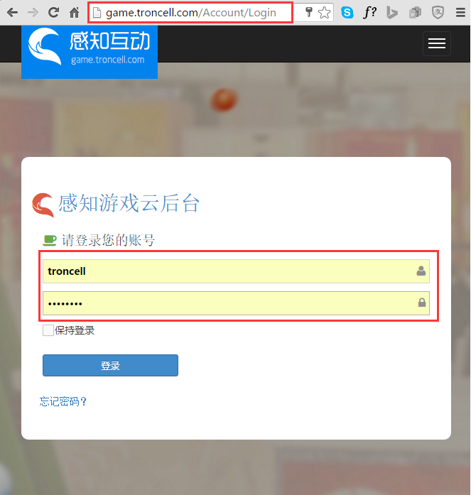
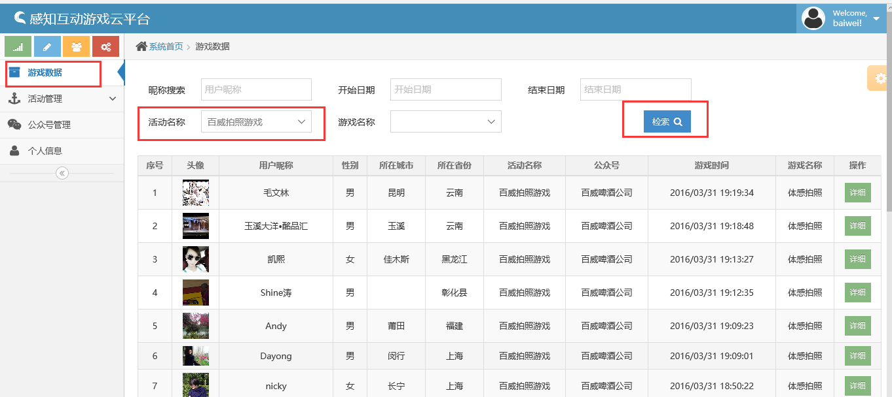
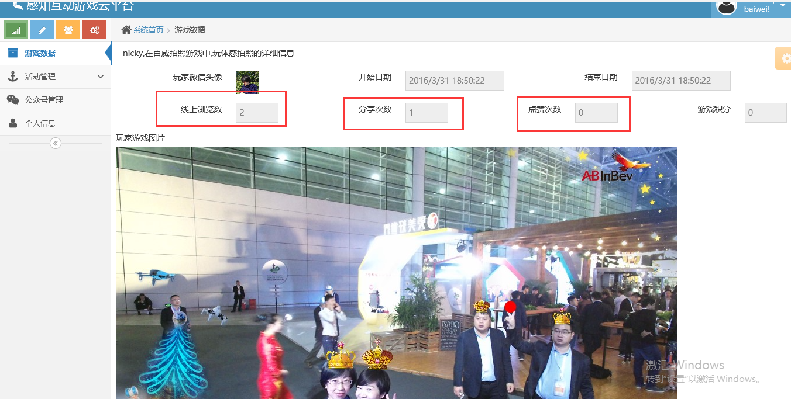

查看游戏数据
================

.. toctree::
   :titlesonly:

By `William Wu`_

游戏数据
----------------

.. contents:: Sections:
  :local:
  :depth: 2

开始之前
----------------

在您开始之前，请确保您有有效的感知互动平台的登录账号。如果想知道如何获得感知互动的云账号，可参考：doc：`获得感知互动云账号<../account/index>`！。

登陆感知互动云平台
-----------------------

打开浏览器（推荐使用Chrome/IE11/Edge), 在浏览器的地址栏里输入 game.troncell.com/account/login,或直接在当前页面点击  `登陆感知互动云平台 <http://game.troncell.com/Account/Login />`_
然后输入您的用户名和密码登陆.

进入感知互动后台活动管理页面
-----------------------------------
   
成功登陆感知互动平台后，通过左边的导航栏，点击游戏数据进入，里面是玩游戏的详细数据，可以检索活动名称，玩游戏用户的昵称和时间搜索。点击详细后可以查看该用户的线上浏览数、分享次数、点赞次数和玩游戏的开始日期和结束日期

