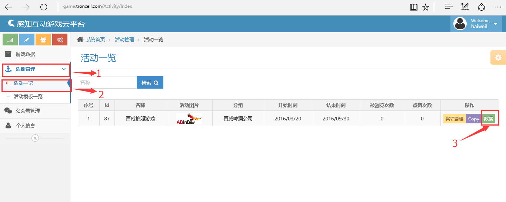
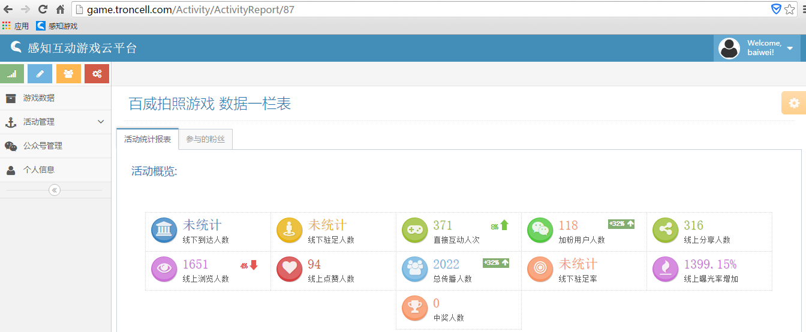
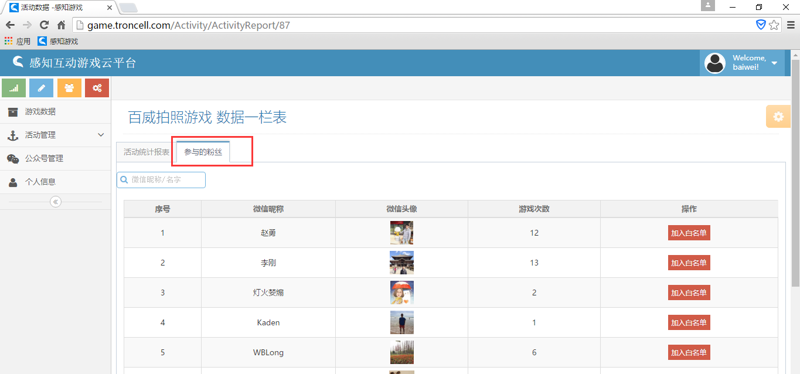
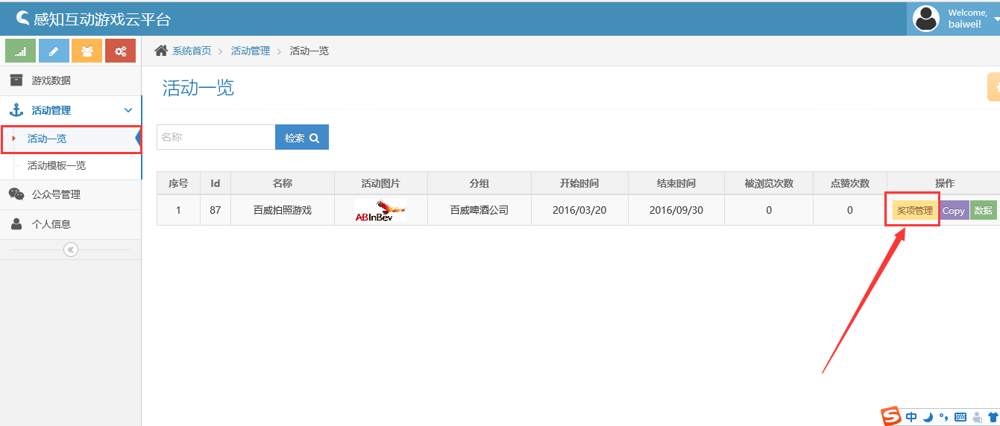
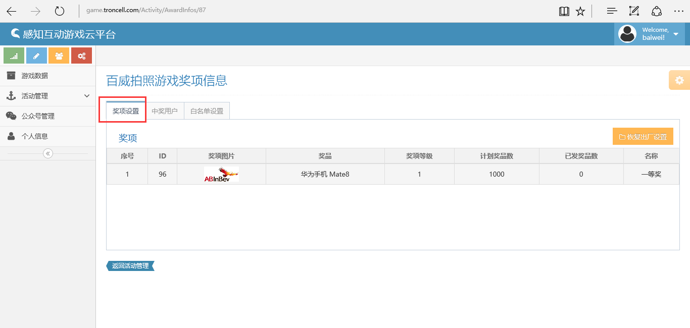
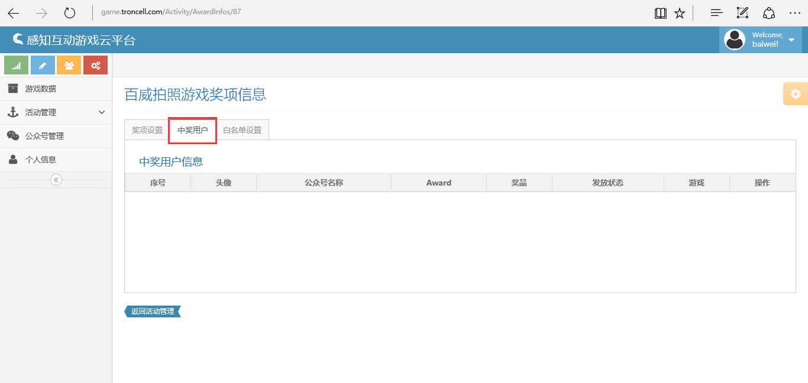
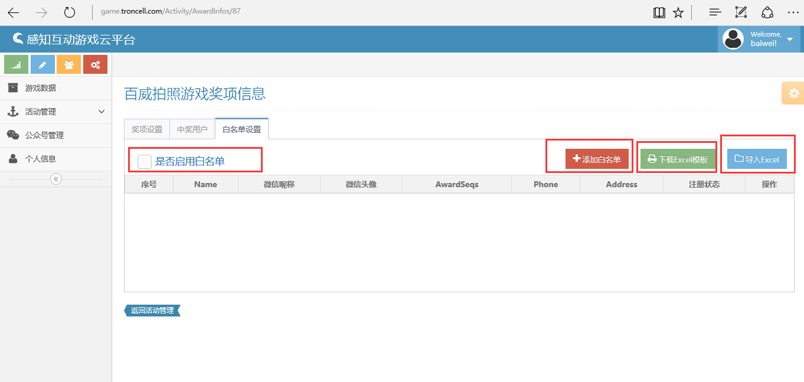

查看活动数据
===============

.. toctree::
   :titlesonly:

By `William Wu`_

活动数据
----------------

.. contents:: Sections:
  :local:
  :depth: 2

开始之前
----------------

在您开始之前，请确保您有有效的感知互动平台的登录账号。如果想知道如何获得感知互动的云账号，可参考：doc：`获得感知互动云账号<../account/index>`！。

登陆感知互动云平台
-----------------------

打开浏览器（推荐使用Chrome/IE11/Edge), 在浏览器的地址栏里输入 game.troncell.com/account/login,或直接在当前页面点击  `登陆感知互动云平台 <http://game.troncell.com/Account/Login />`_
然后输入您的用户名和密码登陆.

.. image:: wechat-authorization/login.png

进入感知互动后台活动管理页面
-----------------------------------

成功登陆感知互动平台后，通过左边的导航栏，导航进入活动管理页面-活动一览.

再点击右边的数据按钮,出现如图数据：直接互动人次、加粉用户人数、线上分享人数、线上浏览人数、线上点赞人数、总传播人数、线上曝光率增加比等

点击参与粉丝可直接查看参与的粉丝的详细信息如：微信昵称、微信头像、游戏次数和加入白名单。

奖项管理(不需要抽奖的可以不设置)
------------------------------------

成功登陆感知互动平台后，通过左边的导航栏，导航进入活动管理页面---活动一览，点击奖项管理，这边可以添加奖项、奖品名称和奖品数量。

点击中奖用户，里面是本次活动中奖用户的信息如：中奖用户的头像、公众号名称、奖品、发放状态、操作核销奖品。

点击白名单设置，用户中奖是可控制的，可以添加中奖用户的白名单、可以选择是否启用白名单，假如用户有中奖的名单可以选择导入excel。

   
