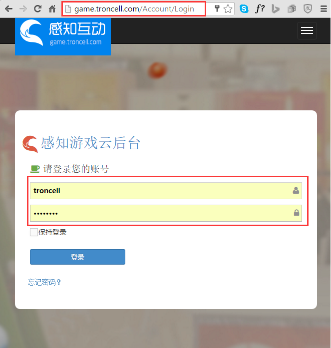

微信公众号授权
=====================

.. toctree::
   :titlesonly:

By `William Wu`_

在这个教程中，会演示如何把自己的微信公众号授权给感知互动公众平台，让自己的公众号能获得线下游戏活动的服务。

.. attention:: 请确保您的微信公众号是服务号，而且是被认证的服务号，才能获得感知互动平台的服务。 微信公众号是什么，如何申请等信息，可访问官网 `微信公众平台 <https://mp.weixin.qq.com/>`_

.. contents:: Sections:
  :local:
  :depth: 2

开始之前
----------------

在您开始之前，请确保您有有效的感知互动云平台的登陆账号。如果想知道如何获得感知互动的云账号，可参考 :doc:`获得感知互动云账号 <../account/index>`!。

登陆感知互动云平台
---------------------

打开浏览器（推荐使用Chrome/IE11/Edge), 在浏览器的地址栏里输入 game.troncell.com/account/login,或直接在当前页面点击  `登陆感知互动云平台 <http://game.troncell.com/Account/Login />`_
然后输入您的用户名和密码登陆.

进入感知互动云后台微信授权页面
---------------------------------

成功登陆感知互动平台后，通过左边的导航栏，导航进入公众号管理页面，再点击右边的+公众号授权按钮。

进入微信授权页面
--------------------------

点击微信公众号登陆授权按钮后，会直接跳转至微信公众平台，进入微信公众号授权流程.
微信公众号授权分为三步，

1. 管理员通过手机微信扫描授权二维码

2. 进入手机授权页面进行授权

3. 授权结果提示

授权二维码页面,需要管理员扫描二维码

微信扫码进入授权

.. attention:: 只有公众号的管理员才具有第三方平台的授权权限，所有请务必使用管理员微信账号进行扫码.

.. Note:: 如果管理员管理了多个公众账号，会提示管理员选择需要具体授权的公众号，如下图：_

授权成功提示

验证微信授权结果
-------------------

当完成微信授权流程后，浏览器的当前会面会自动跳转到公众号授权管理页面，就可以看到刚刚被授权成功的公众号，而且状态为已授权状态.

授权完成
------------

恭喜您,到此，微信公众号授权就完成啦。以后您的活动，都会居于当前的公众号来吸粉，进行线下互动。