游戏云平台品牌商使用教程
==========================

by `Kevin`

.. toctree::
   :titlesonly:

.. note:: 本页面图片根据原图按比例缩放，可使用ctrl+鼠标滚轮放大至200%进行全屏查看。

.. contents:: Sections:
  :local:
  :depth: 2

登录
--------------
登录地址：
http://game.troncell.com

首页

.. image:: _static/首页.png 

登录界面 

.. image:: _static/登录.png 

step1.点击页面右上角“商家登录”，step2.正确输入账号、密码，step.3点击“登录”按钮。

平台主界面

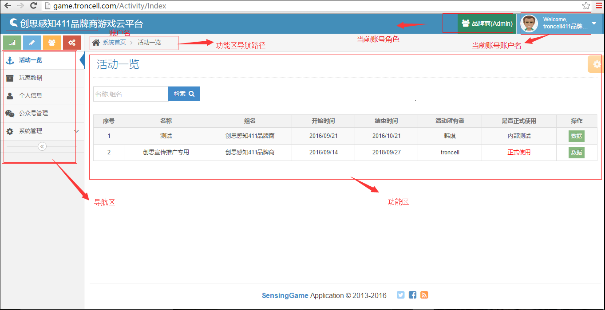

功能权限概叙 
-------------
   1. 活动一览：查看当前组对应的活动和各活动对应的玩家统计数据。
   #. 玩家数据：定向查询对应活动的玩家参与游戏的详细信息。
   #. 个人信息：查看并修改当前用户个人信息及密码。
   #. 公众号管理：首次登录需要对公众号进行授权，授权成功后将以表格的形式显示公众号相关信息。
   #. 用户管理：查看当前账户对应的组下的所有用户相关信息。
 

详细功能及操作介绍 
--------------------

1.活动一览
^^^^^^^^^^^^
     a. 活动查询：定向查询当前品牌商对应的活动。在“检索”一栏输入框中输入想要查询的活动名称或对应组名，然后点击“检索”，即可查询出对应的活动。
     #. 数据概览：点击列表栏中“数据”按钮，即可进入到“数据一览表”界面，在活动统计报表一栏下，能直观看到当前活动的统计数据以及线状图数据报表；选择起止日期和时间刻度，点击“搜索按钮”可定向查询活动对应的参与数据。
     #. 参与的粉丝：显示参与活动的玩家头像、昵称和游戏次数，输入玩家的游戏昵称并点击“放大镜”或按Enter键可定向查询对应玩家信息。点击操作栏“加入白名单”按钮，可将当前用户加入到白名单。
     #. 玩家数据：查看玩家参与游戏的详细数据，通过选择或输入各对应信息可定向检索对应的玩家详细数据。点击列表操作栏“详细”按钮可查看玩家现场游戏图片。
     #. 中奖信息查询及核销：查看中奖用户信息；点击操作栏“核销”按钮，输入中奖用户提供的SecurityCode，点击确定即可核销奖品。

活动一览主界面

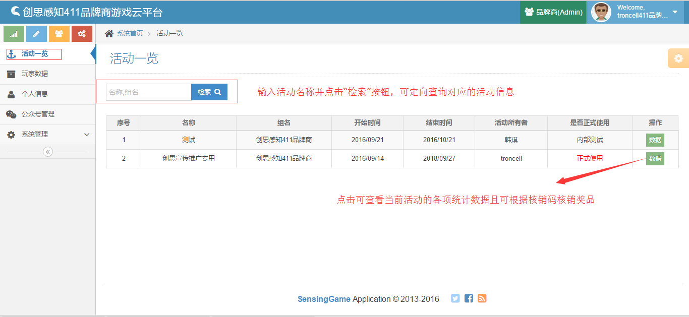

活动数据概览

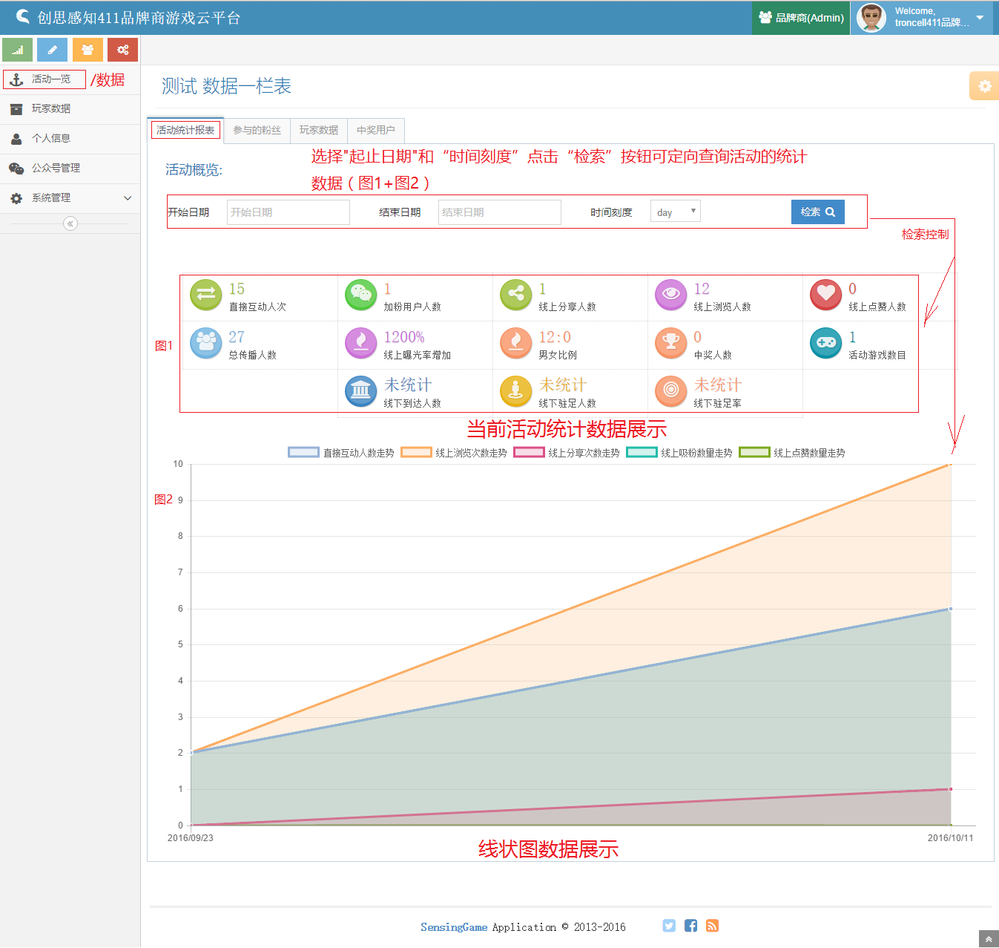

参与的粉丝界面

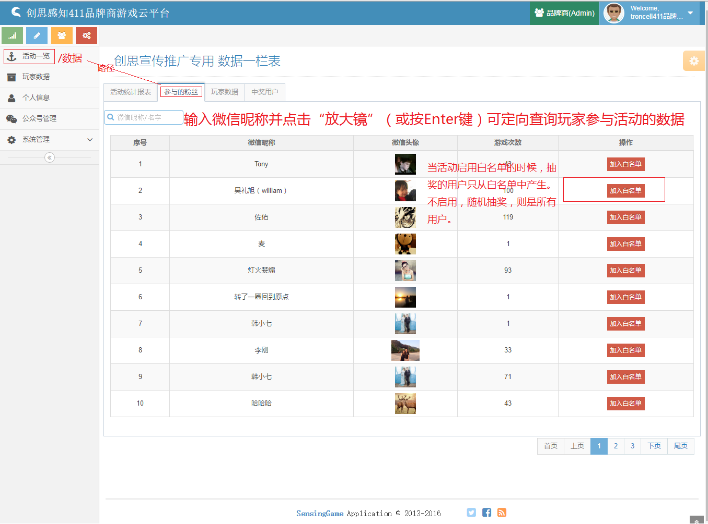

玩家数据

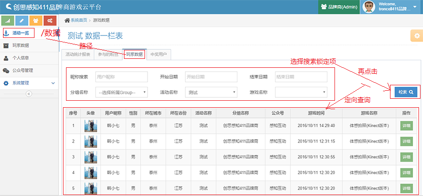

玩家数据详细信息显示页面

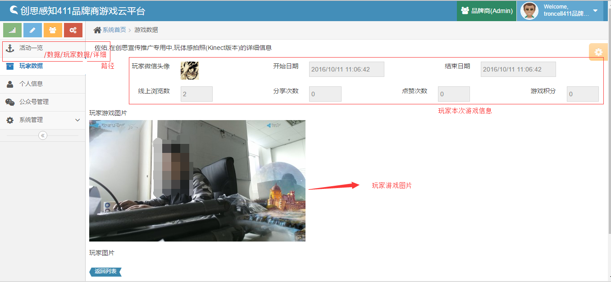

中奖用户信息界面

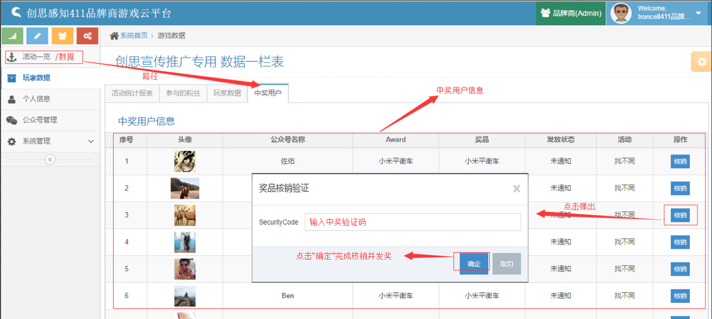

2.玩家数据
^^^^^^^^^^^^
   a. 数据查询：查看玩家的游戏记录，通过选择或输入各对应信息可定向检索对应的玩家游戏数据。
   #. 详情查看：点击列表操作栏“详细”按钮可查看玩家本次游戏的详细信息，有图片交互的将显示玩家游戏图片。

玩家数据主界面

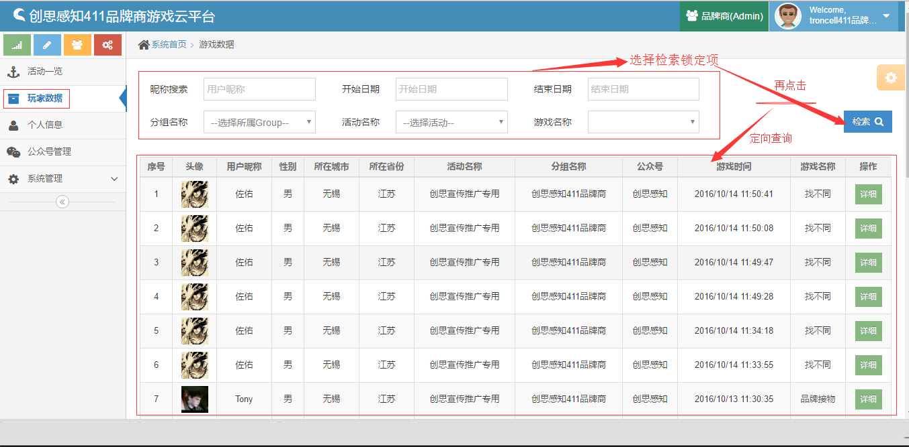

玩家数据详细

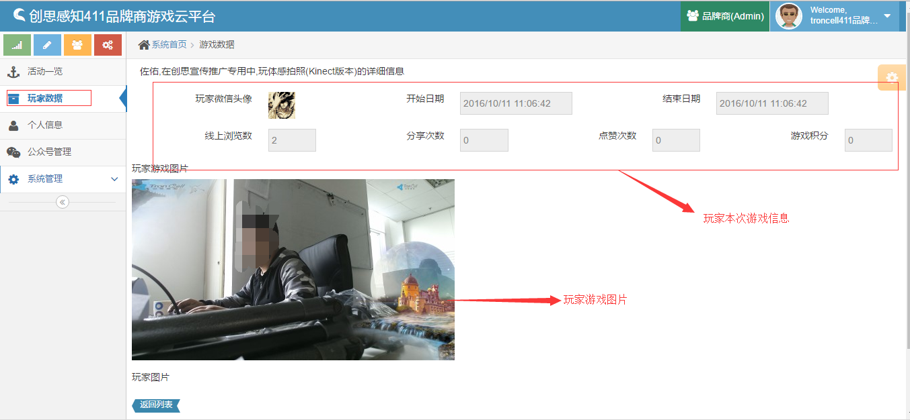

3.个人信息
^^^^^^^^^^^^
   a. 修改个人信息：在“基本信息”页面对应的信息框中输入要修改的信息点击“√”后完成操作。
   b. 修改密码：在“密码设置”页面输入原始密码，然后键入新的密码并二次确认，点击保存按钮，当前账户密码修改成功。

个人信息查询修改界面

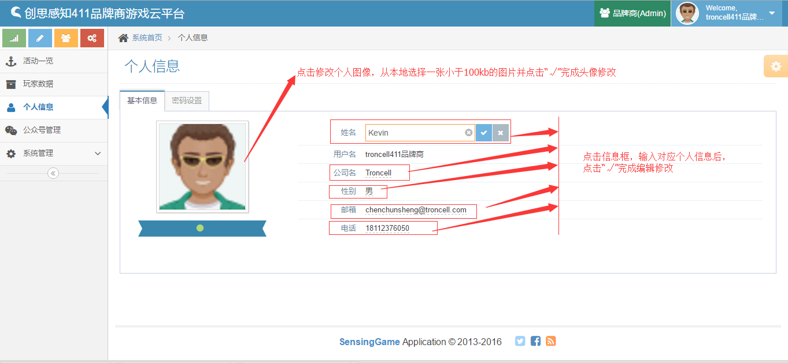

密码修改界面

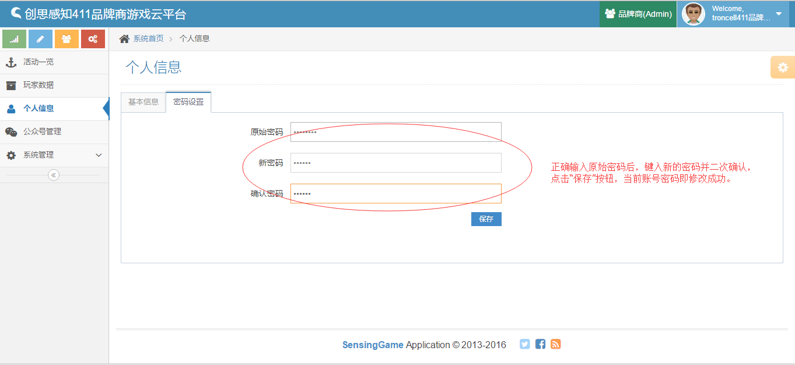

4.公众号管理
^^^^^^^^^^^^
   a. 绑定公众号：首次使用时需要绑定当前品牌商对应的公众号（要服务号，非订阅号）。点击页面右上角绿色的“微信公众号登录授权”按钮， 出现二维码后用贵公司微信服务号管理员的微信进行扫码，并且在手机上选择相应的服务号允许授权即可。
   #. 已绑定公众号的品牌商账号进入当前界面可查看公众号的相关信息且可再次添加其他公众号。

绑定公众号图解

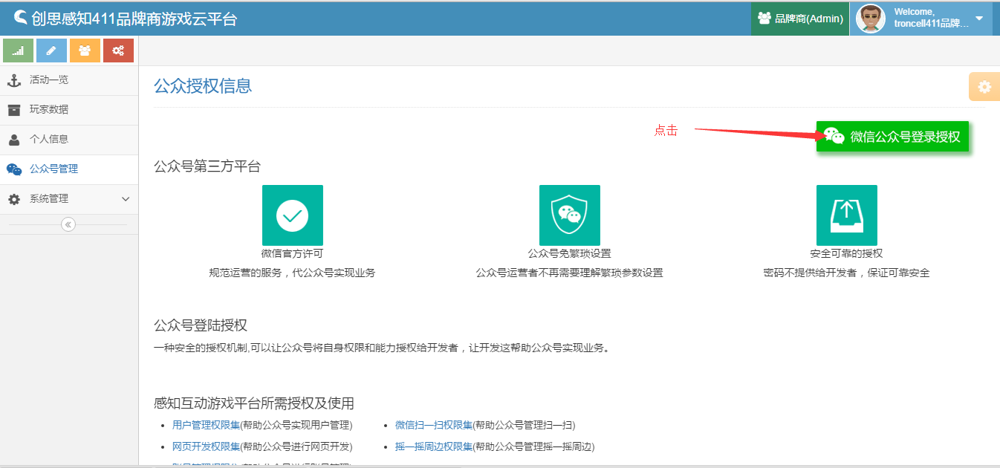

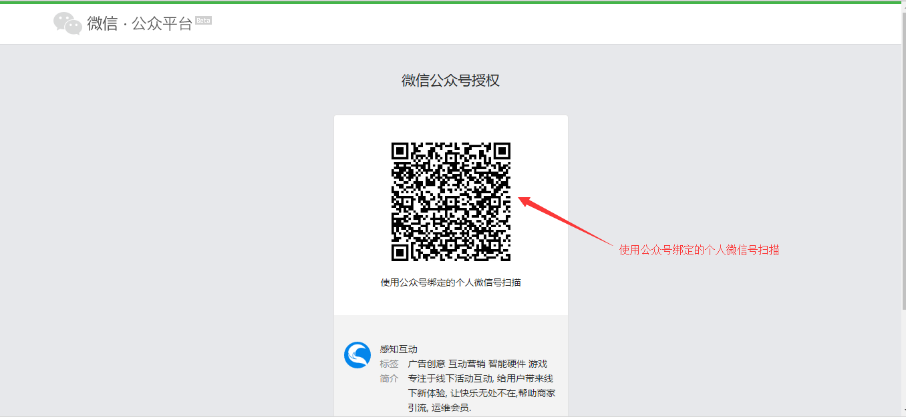
用贵公司微信服务号管理员的微信进行扫码，并且在手机上选择相应的服务号允许授权即可。

已绑定公众号界面展示

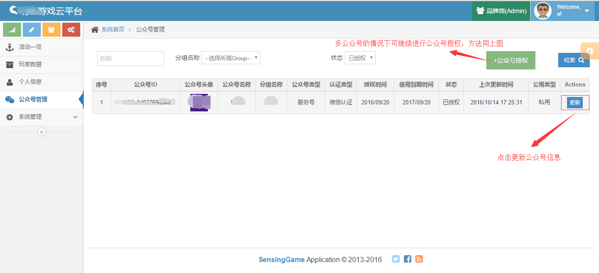

5.用户管理
^^^^^^^^^^^^
   a. 查看当前品牌商对应的各账号信息。

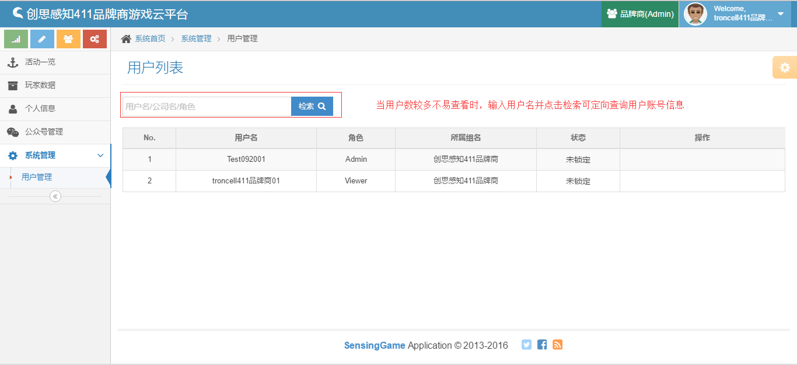

