游戏云平台集成商使用教程
==========================

by `Kevin`

.. toctree::
   :titlesonly:

.. note:: 本页面图片根据原图按比例缩放，可使用ctrl+鼠标滚轮放大至200%进行全屏查看。

.. contents:: Sections:
  :local:
  :depth: 2

登录
--------------
登录地址：
http://game.troncell.com

首页

.. image:: _static/首页.png 

登录界面 

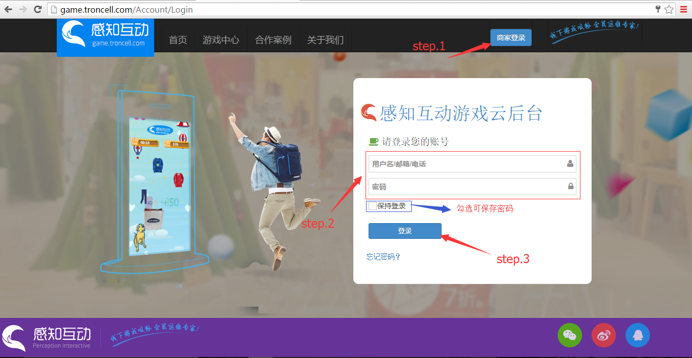

step1.点击页面右上角“商家登录”，step2.正确输入账号、密码，step.3点击“登录”按钮。

平台主界面

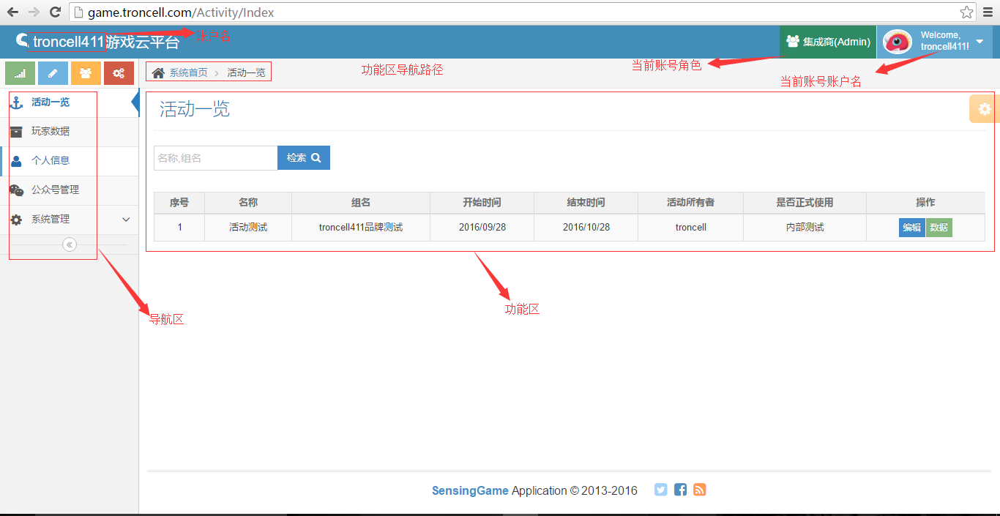

功能权限概叙 
-------------
   1. 活动一览：查看当前组管理的品牌商对应活动和各活动对应的玩家统计数据。
   #. 玩家数据：定向查询对应活动的玩家参与游戏的详细信息。
   #. 个人信息：查看并修改当前用户个人信息及密码。
   #. 公众号管理：查看当前组对应的各品牌商的公众号相关信息。
   #. 分组管理：对当前组及组以下品牌商进行增删改查操作。
   #. 用户管理：对当前组及组下的品牌商账号进行管理，包括增（增加用户账号）、删（删除用户账号）、改（修改用户密码/锁定用户账号）、查（查询用户）操作。
   #. 广告管理：为组下各品牌商活动添加广告且能够修改和删除广告内容。
   #. 标签管理：为设备、计数器、广告和游戏添加标签并可对其进行修改和删除操作。（标签是活动和各元素（如广告）连接的桥梁，想要为活动建立广告或其他元素，首要任务就是创建标签）
   #. 游戏管理：查看当前平台所有游戏的相关信息。
   #. 接口管理：查看当前组对应的品牌商的相关接口。
 

详细功能及操作介绍 
--------------------

1.活动一览
^^^^^^^^^^^^
     a. 活动查询：定向查询当前组下品牌商对应的活动。在“检索”一栏输入框中输入想要查询的活动名称或对应组名，然后点击“检索”，即可查询出对应的活动。
     #. 数据概览：点击列表栏中“数据”按钮，即可进入到“数据一览表”界面，在活动统计报表一栏下，能直观看到当前活动的统计数据以及线状图数据报表；选择起止日期和时间刻度，点击“搜索按钮”可定向查询活动对应的参与数据。
     #. 参与的粉丝：显示参与活动的玩家头像、昵称和游戏次数，输入玩家的游戏昵称并点击“放大镜”或按Enter键可定向查询对应玩家信息。点击操作栏“加入白名单”按钮，可将当前用户加入到白名单。
     #. 玩家数据：查看玩家参与游戏的详细数据，通过选择或输入各对应信息可定向检索对应的玩家详细数据。点击列表操作栏“详细”按钮可查看玩家现场游戏图片。
     #. 中奖信息查询及核销：查看中奖用户信息；点击操作栏“核销”按钮，输入中奖用户提供的SecurityCode，点击确定即可核销奖品。
     #. 基本信息：对活动的基本信息进行编辑。点击“活动一览主界面”操作栏“编辑”按钮，即可进入到“基本信息”界面，可对活动名称、地址、时间、logo等项进行编辑。
     #. 高级设置：
     #. 游戏管理：查看当前活动所有游戏信息，包含游戏秘钥（游戏版本与平台活动关联的桥梁。运行游戏版本按F8或h键可修改替换秘钥）
     #. 奖项管理：

活动一览主界面

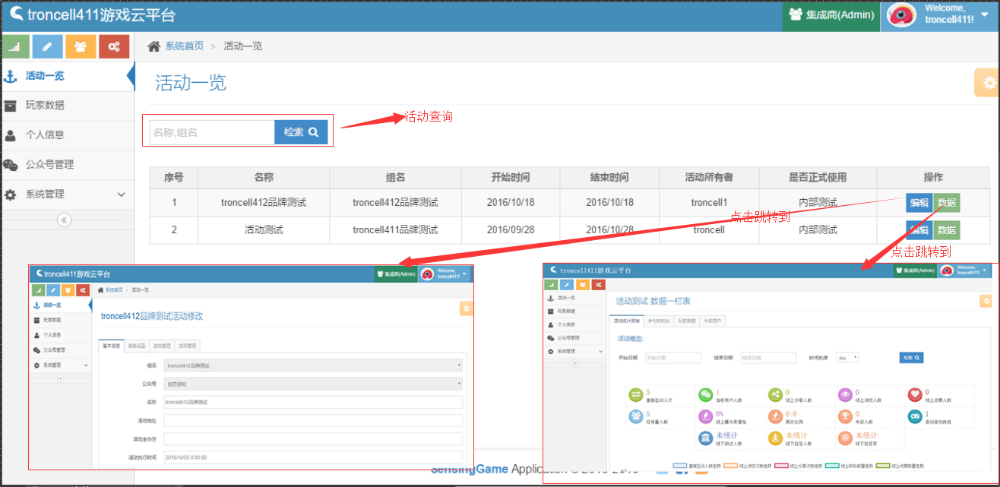

活动数据概览

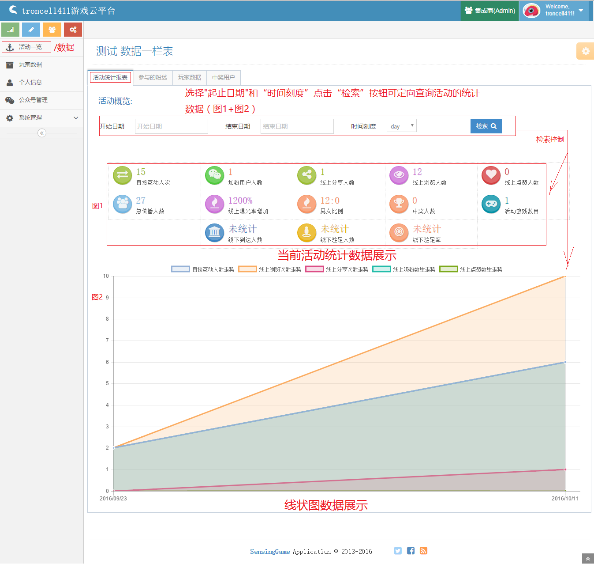

参与的粉丝界面

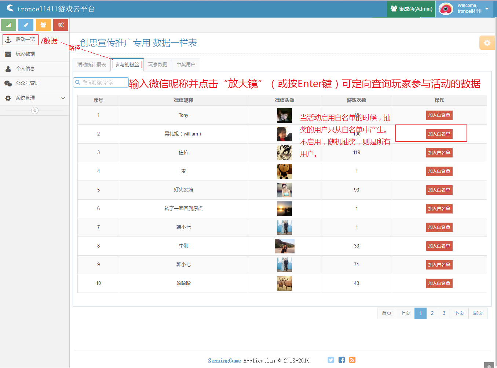

玩家数据

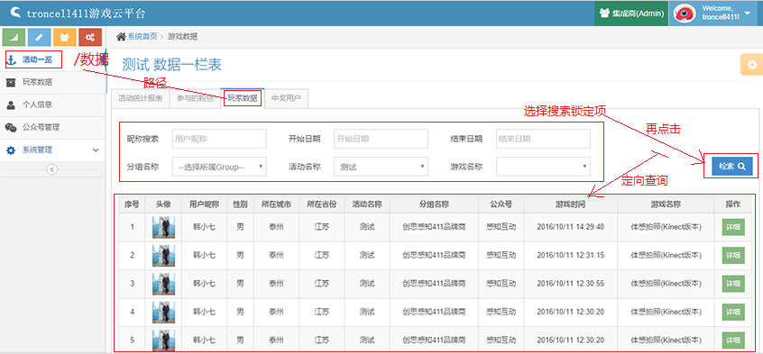

玩家数据详细信息显示页面

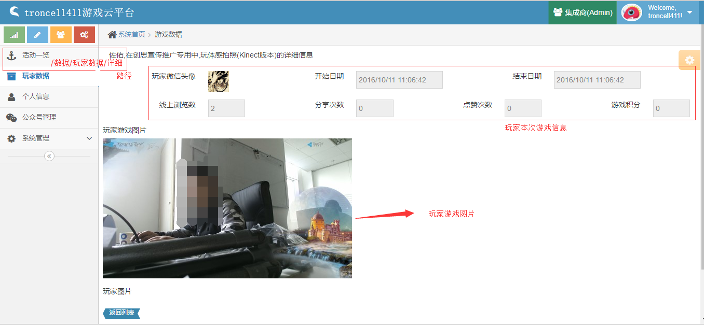

中奖用户信息界面

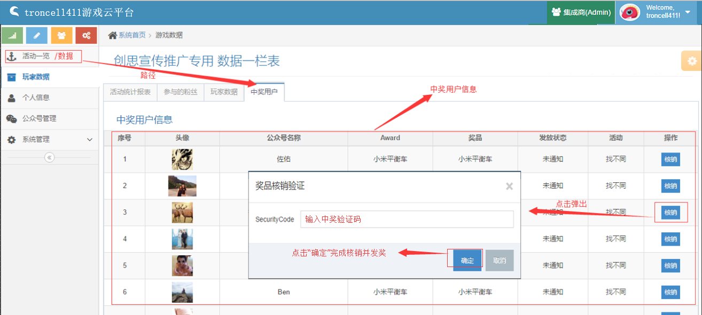

基本信息修改界面

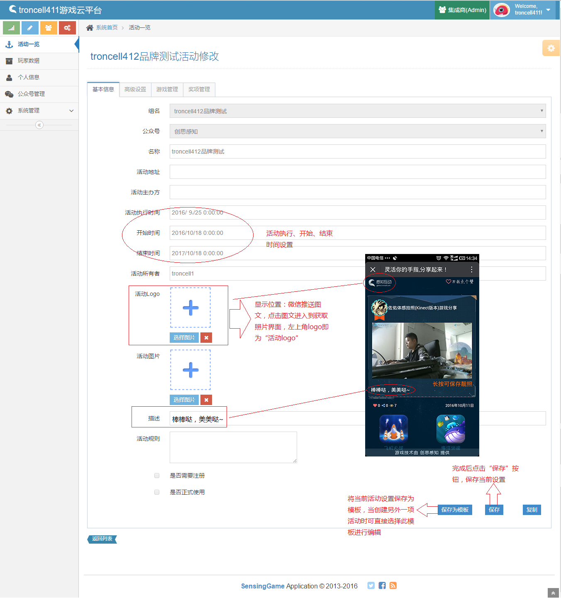

高级设置界面 
11111111111111111111111111111111111111111111

游戏管理界面 

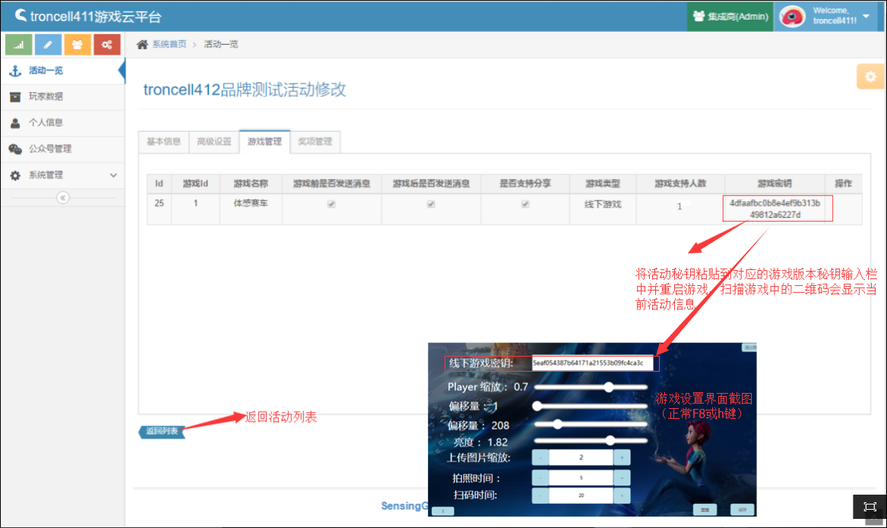

奖项管理界面
11111111111111111111111111111111111111

2.玩家数据
^^^^^^^^^^^^
   a. 数据查询：查看玩家的游戏记录，通过选择或输入各对应信息可定向检索对应的玩家游戏数据。
   #. 详情查看：点击列表操作栏“详细”按钮可查看玩家本次游戏的详细信息，有图片交互的将显示玩家游戏图片。

玩家数据主界面

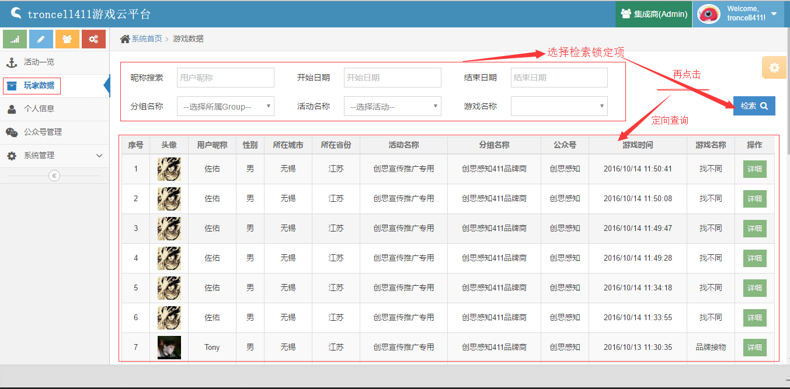

玩家数据详细

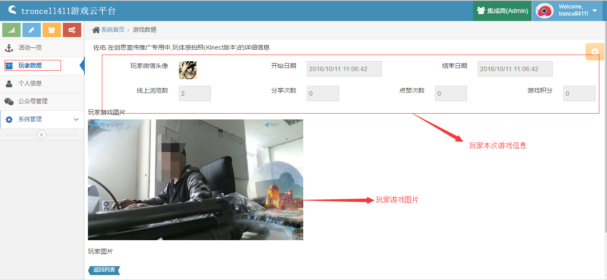

3.个人信息
^^^^^^^^^^^^
   a. 修改个人信息：在“基本信息”页面对应的信息框中输入要修改的信息点击“√”后完成操作。
   b. 修改密码：在“密码设置”页面输入原始密码，然后键入新的密码并二次确认，点击保存按钮，当前账户密码修改成功。

个人信息查询修改界面

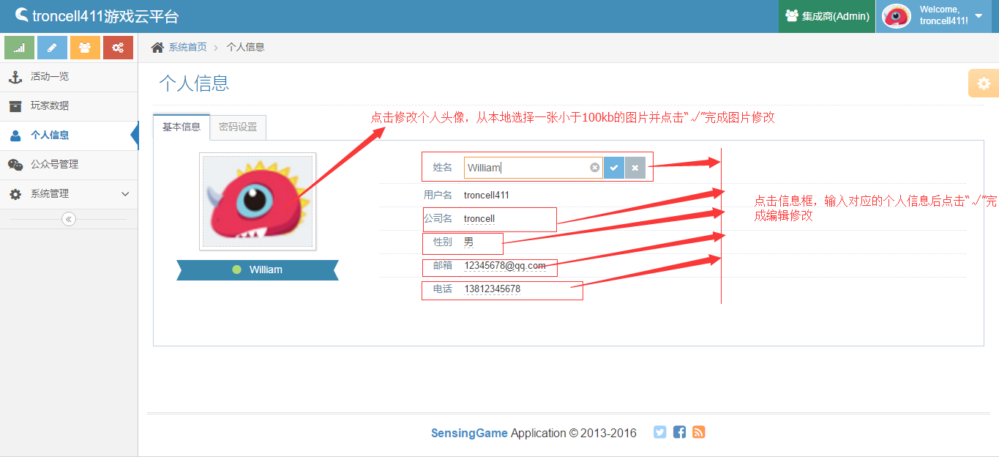

密码修改界面

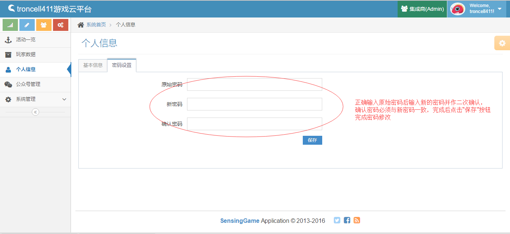

4.公众号管理
^^^^^^^^^^^^
   a. 查看并更新当前集成商组下各品牌商的公众号信息。

公众号管理界面展示

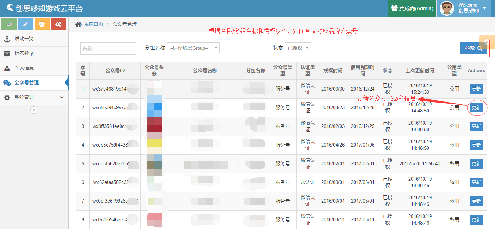

5.分组管理
^^^^^^^^^^^^
   a. 新建组：点击分组管理主界面“新建组”按钮，跳转至新建组页面，
   #. 组查询：在输入框中输入组的名称点击“检索”，可定向查询对应组信息。
   #. 组详细信息：点击组列表操作栏“详细”按钮，跳转至组详情页面，可查看当前组的详细信息。
   #. 组信息编辑：点击组列表操作栏“编辑”按钮，跳转至组信息编辑页面，可编辑组的详细信息。

分组管理主界面

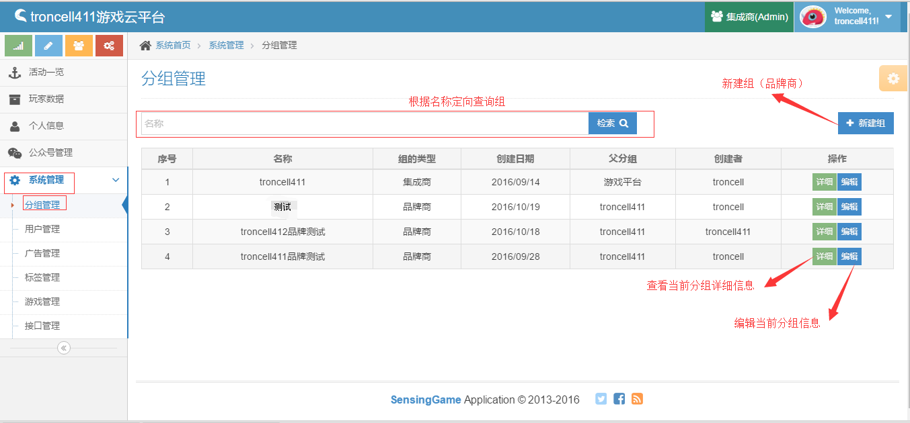

新建分组界面

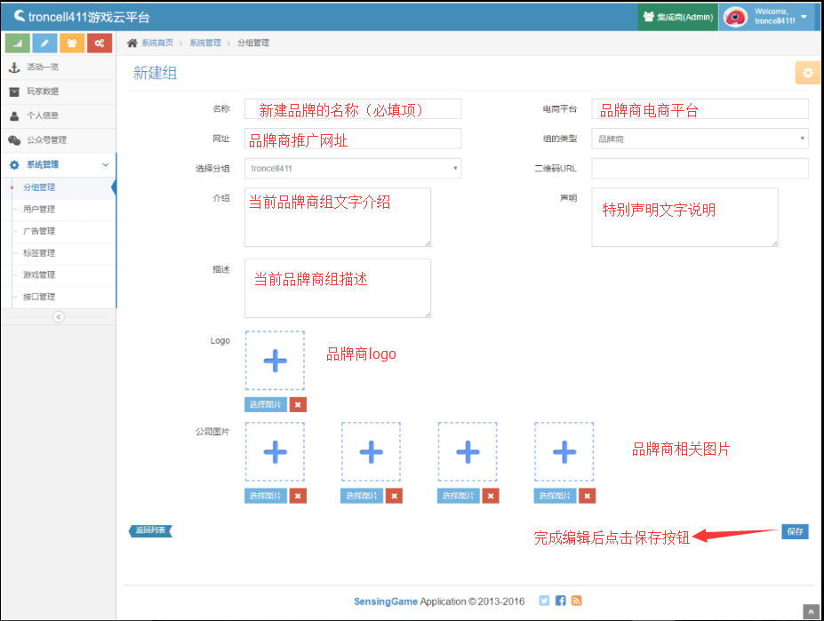

6.用户管理
^^^^^^^^^^^^^^
   a. 添加用户：为当前组或组下的品牌商创建新的用户。点击用户管理主界面右侧“添加用户”按钮，跳转至添加用户页面，填写用户名、电话、邮箱，并选择用户对应的分组和角色权限（admin权限最高，其次是editor）
   #. 用户查询：在输入框中输入用户名/公司名或角色，并点击检索，可定向查询当前组或组下品牌商对应的用户账号。
   #. 删除用户：点击操作栏删除按钮，可删除对应的用户账号。
   #. 密码重置：即修改密码。点击操作栏“密码重置”按钮，跳出密码重置弹出框，在密码重置一栏重新输入新的密码即可。
   #. 锁定账户：点击操作栏“锁定”按钮即可锁定选定的账户。
 
 用户管理主界面

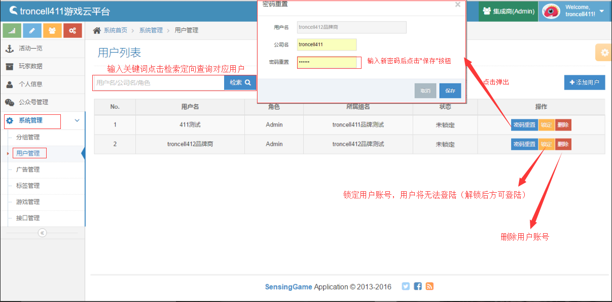

添加用户界面

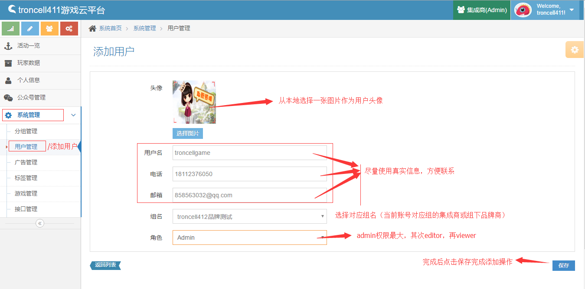

7.标签管理
^^^^^^^^^^^^^

   a. 标签查询：标签主界面点击操作栏“管理”按钮，以广告为例，页面进入到广告标签列表界面，在检索框输入标签名称，并点击“检索”，可定向查询标签列表。
   #. 添加标签：标签主界面点击操作栏“管理”按钮，以广告为例，页面进入到广告标签列表界面，点击“添加”按钮，弹出添加标签框，选择组名并填写标签内容，点击“确定”完成添加。
   #. 编辑标签：标签主界面点击操作栏“管理”按钮，以广告为例，页面进入到广告标签列表界面，点击操作栏编辑按钮，弹出编辑框，可重新修改组名和内容，修改完成后点击“确定”保存编辑。
   #. 删除标签：标签主界面点击操作栏“管理”按钮，以广告为例，页面进入到广告标签列表界面，点击操作栏删除按钮，将删除当前选择标签。

标签概览主界面

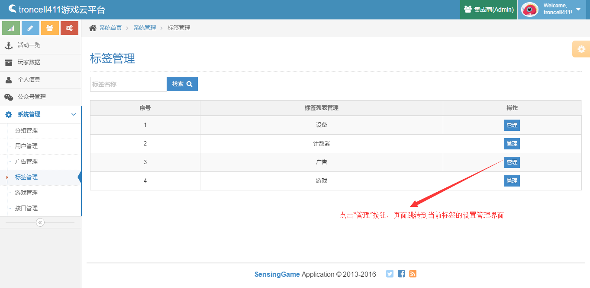

标签管理界面

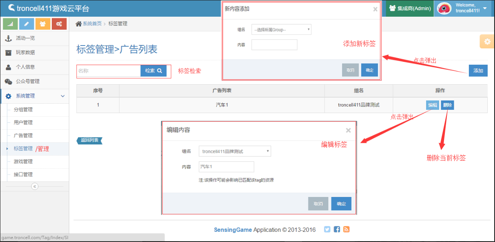

.. attention:: 标签是广告与活动建立连接的桥梁，创建好标签后，在广告管理标签选择框中选择对应的标签，然后在对应的活动/高级设置/广告 中选择对应的标签，这样广告就在活动中成功添加。

8.广告管理
^^^^^^^^^^^

广告显示位置：微信推送图文，点击图文进入，页面最下方即是。如图“广告示例”。

广告示例

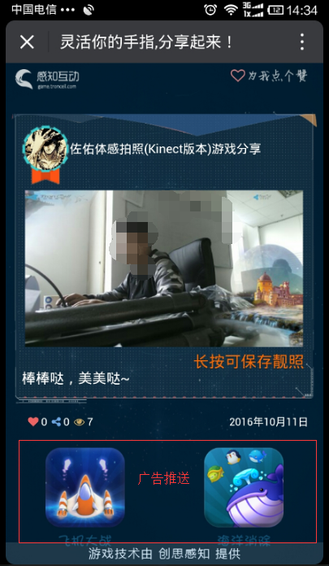

a. 广告查询：广告管理主界面输入框中输入广告名称并点击“检索”，可定向查询对应广告列表。
#. 添加广告：点击广告管理主界面右侧“添加广告”按钮，跳转至添加广告界面，选择对应品牌商（组名），并填写广告名称、文本内容，上传广告图片，如有推送链接请将链接填入到URL栏，然后选择对应的标签（广告类型线上线下暂均可）
#. 编辑广告：点击广告管理主界面操作栏“编辑”按钮，跳转到广告编辑界面，修改相应内容后点击“保存”完成编辑。
#. 删除广告：点击广告管理主界面操作栏“删除”按钮即会删除当前广告项。

广告管理主界面 

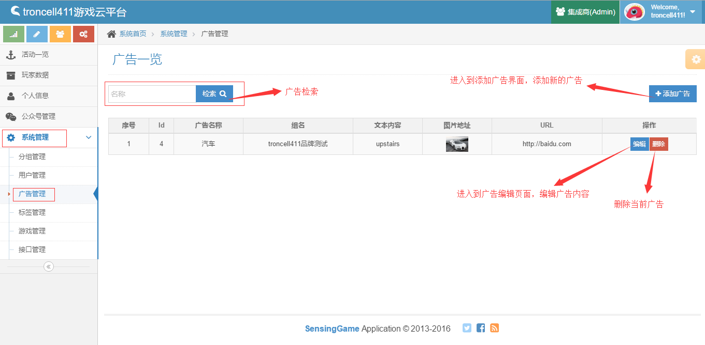

添加广告界面

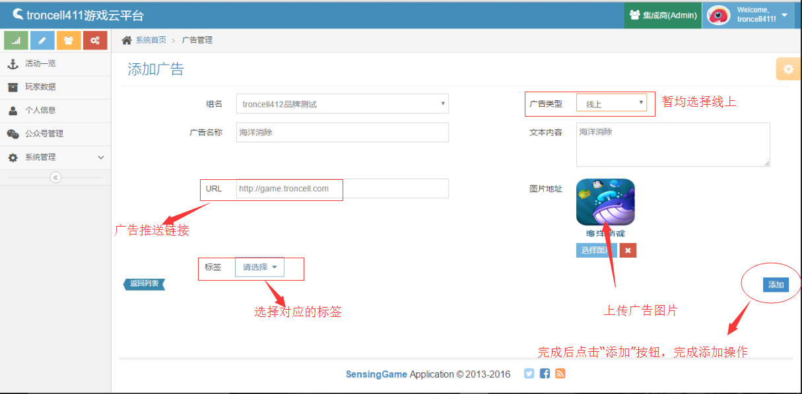

编辑广告界面

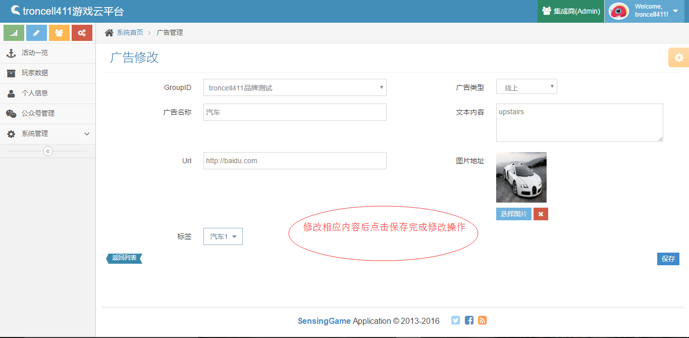

9.游戏管理
^^^^^^^^^^^^
平台当前游戏总览。

游戏管理主界面

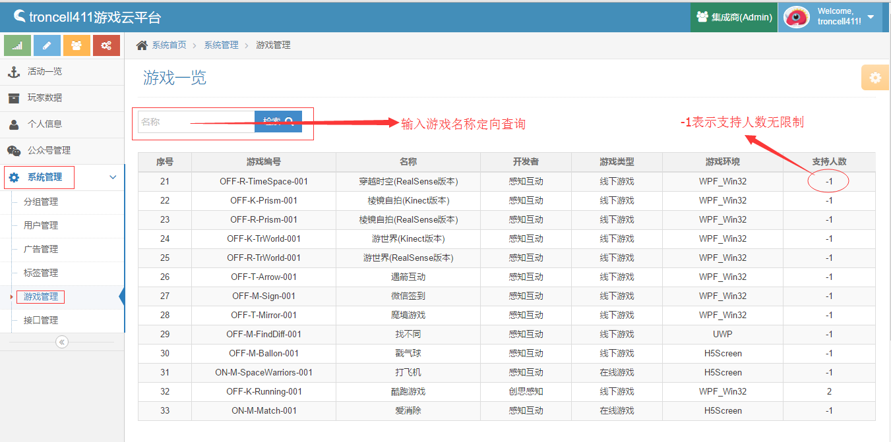

10.接口管理
^^^^^^^^^^^^
查看当前账户对应组下品牌商接口。

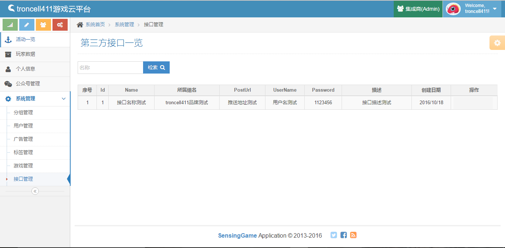
