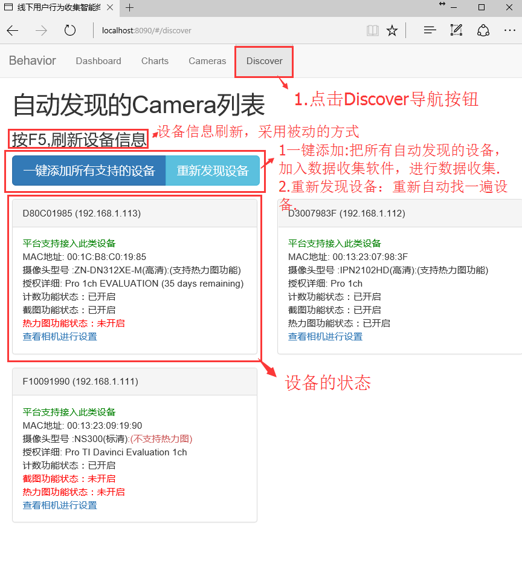

收集软件的使用教程
=================

.. toctree::
   :titlesonly:

By `William Wu`_

.. contents:: Sections:
  :local:
  :depth: 2

开始使用之前
----------------
在你开始使用用户行为收集软件之前，请确保局域网内的客流摄像已链接好网络,并配置好摄像机的相关配置,并正确划分好区域以及计数器相关设置。 想理解更多关于设备配置的信息，请点击这里.

功能概述
--------------
用户行为收集软件采用B/S架构，利用浏览器就可以访问(手机也做了适配),默认访问端口为8090.IP地址为安装行为收集软件的机器。如 http://192.168.1.121:8090.

线下用户行为收集软件主要分为4大主要功能.

1.Dashboard, 配置上传云服务器的线下密钥,以及数据同步云的时间。主要是把线下的数据上传至特定的云服务器账号.
2.Charts, 以客流摄像机为单位，查看其下计数器的历史数据。主要用于查看线下设备的计数器是否可以抓取数据并被收集软件所收集。
3.Cameras, 查看已添加客流设备的详细信息，同时可手动添加特定设备。主要用户查看已添加设备的详细信息，如一些功能是否开启，设备是否为高清摄像机，以及设备的License信息等.
4.Discover, 自动发现局域网内所有的客流设备。用于帮助部署人员快速发现局域网内的相关设备，并可一键添加所有的设备，用户收集数据。

所以下会对所有4个主要功能进行详细的介绍.

Dashboard详细功能
--------------------
功能一栏.

.. image:: _static/Dashboard.png

Charts详细功能
--------------------

Camera详细功能
--------------------

添加新设备功能

删除已连接的设备

.. image:: _static/Delete.png

设备信息刷新

Discovery详细功能
--------------------

其它功能
---------------------

