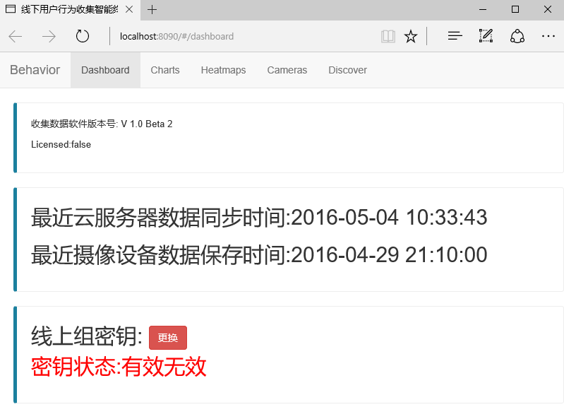

本地数据收集软件部署教程
========================

.. toctree::
   :titlesonly:

By `William Wu`_

.. contents:: Sections:
  :local:
  :depth: 2

开始使用之前
--------------
在你开始使用本地数据收集软件之前，首先必须要确保硬件环境和软件环境与之匹配，然后下载并运行SeemKatHubCmd.exe，访问localhost：8090或通过其他机器访问ip:8090。

硬件环境
---------
Aopen 3250 双核 4G 500G

软件环境
----------
.Net framework 4.5
C++.

部署软件
----------
软件zip下载
部署软件/Windows Service--- Install_Service.bat.
//
SeemkatHubCmd.exe ----------- Windows Application.

验证是否部署成功
----------------
在本机访问
http://localhost:8090

或者通过其它机器访问服务器ip地址
http://192.168.1.50:8090

出现如下相似照片，表明软件部署成功.

