云后台品牌商使用教程
==========================

by `Kevin`

.. toctree::
   :titlesonly:

.. note:: 本页面图片根据原图按比例缩放，可使用ctrl+鼠标滚轮放大至200%进行全屏查看。

.. contents:: Sections:
  :local:
  :depth: 2

功能权限说明
--------------
查看旗下门店各项报表数据，提取各门店的数据并进行数据对比和分析。

功能权限概叙 
-------------
  1. 仪表盘：连锁店报表数据一览，查看当前连锁店对应数据报表。
  #. 报表一览：查看当前连锁店和旗下所有门店的报表数据。
  #. 门店一览：查看并编辑旗下所有门店的对应信息。
  #. 我的设备：查看旗下所有门店的设备信息。
  #. 节假日设置：查看并编辑旗下门店对应的节假日信息。
  #. 个人设定：修改当前账户个人信息及密码。

详细功能及操作介绍
------------------

1.仪表盘
^^^^^^^^^^  
  a. 选定客流数据的起止日期和时间刻度并点击“检索”按钮可查询对应的客流数据报表。

仪表盘界面

  .. image:: _static/pp仪表盘.png

2.报表一览 
^^^^^^^^^^^
  a. 查看报表数据：点击“报表一览”页面操作栏“数据”按钮，页面将跳转至报表查看界面，选择起止时间和时间刻度后点击检索，报表将呈现对应的客流数据。点击“导出CSV”，系统将当前报表数据以exl的形式下载至本地供数据分析。
  b. 查询报表：在检索一栏输入报表名称或所属分组后点击检索按钮可定向查询报表列表。

报表管理主界面

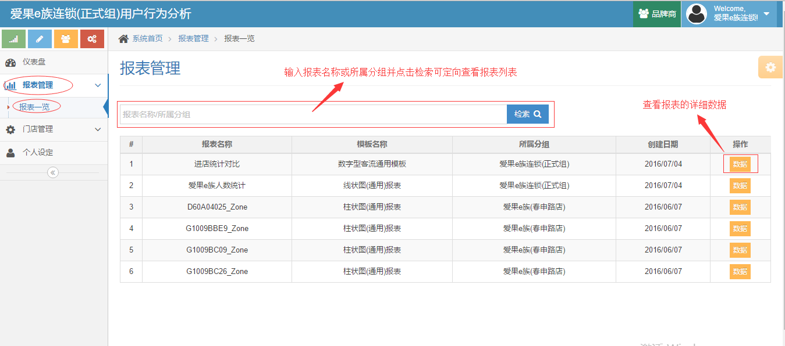

查看报表数据

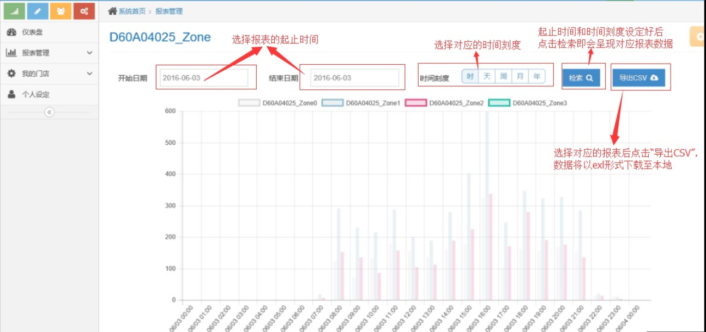

3.门店一览 
^^^^^^^^^^^^
  a. 查看门店详情：点击操作栏“详情”按钮可查看门店的详细信息。
  #. 编辑门店信息：点击操作栏“编辑”按钮，页面跳转至信息编辑界面，可对门店信息进行编辑。编辑完成后点击“保存”，页面跳转回店的信息主界面，编辑操作完成。
  #. 查询门店：在检索一栏输入门店名称后点击检索按钮可定向查询门店列表（支持模糊查询）。
  #. 新建门店：点击“新建组”按钮，页面跳转至新建组界面，编辑各项信息后点击保存，完成新建门店操作。
  #. 查看门店仪表盘：点击操作栏“仪表盘”按钮页面跳转至对应门店的报表一览界面，设置起止时间和时间刻度并点击“检索”按钮可查看当前门店所有报表信息。

门店一览主界面

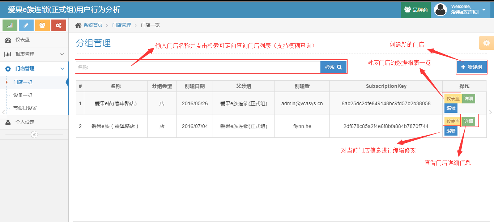

新建门店编辑界面

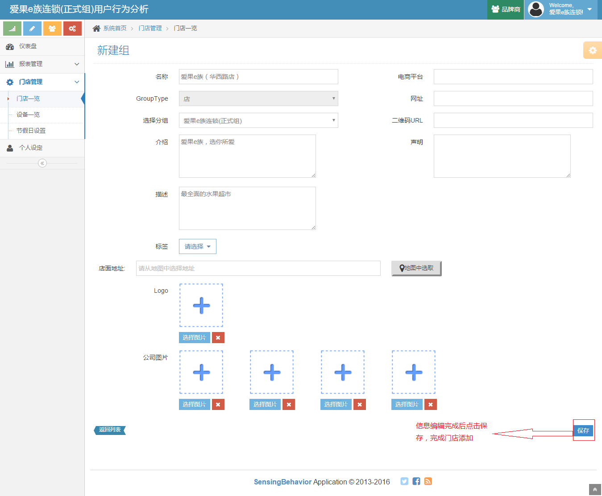

查看门店仪表盘

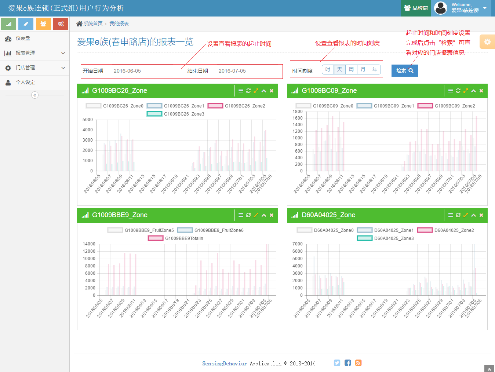

4.设备一览 
^^^^^^^^^^^^
  a. 设备详情：点击操作栏“详情”按钮，页面将跳转至设备详情界面， 可查看设备的详细信息，同时也可查看设备内计数器线图报表以及热力图。设置开始时间和结束时间点击“检索”，“设备内计数器线图报表”将显示对应的报表图，点击“导出CSV”可将报表数据以exl的形式导出。
  b. 设备查询：在检索一栏输入设备名或所属组名后点击检索按钮可定向查询设备列表。

设备管理主界面

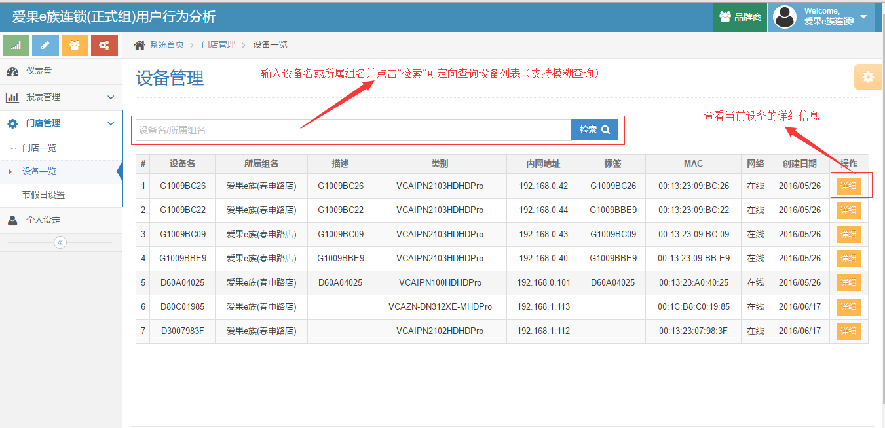

设备详情

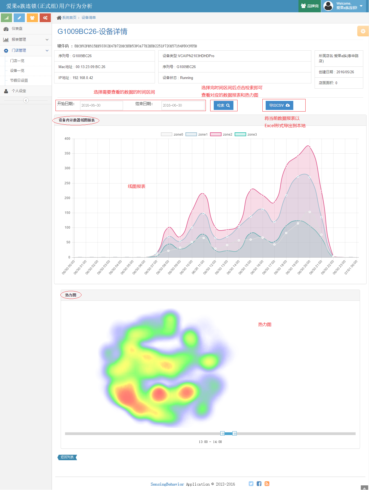

5.节假日设置 
^^^^^^^^^^^^
  a. 添加节假日：点击节假日设置首页“添加”按钮，跳出添加节假日弹出框，选择日期和节假日类型并输入节假日描述信息点击确定按钮完成添加。
  b. 下载模板并导入：点击页面“下载Excel模板”按钮下载模板至本地并编辑，完成后保存并关闭文件，然后点击“导入Excel”选择编辑完成的Excel文件，点击确定，导入文件完成。
  c. 节假日查询：选择想要查询的节假日的开始日期和结束日期并点击“检索”即可定向查询节假日列表。
  d. 查看节假日详情：点击操作栏“详细”按钮可查看对应节假日的详细信息。
  e. 编辑节假日：点击操作栏“编辑”按钮，跳出编辑节假日弹出框，选择节假日类型并输入节假日描述信息点击确定按钮完成修改。
  f. 删除节假日：点击操作栏“删除”按钮，弹出框提示是否确认删除，“OK”确认删除、“Cancel”取消。

节假日主界面

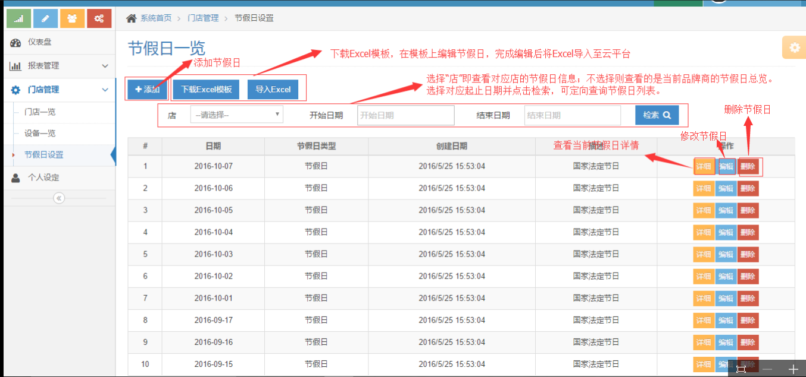

添加节假日Excel界面

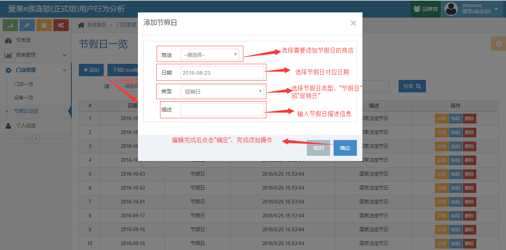

导入节假日Excel界面

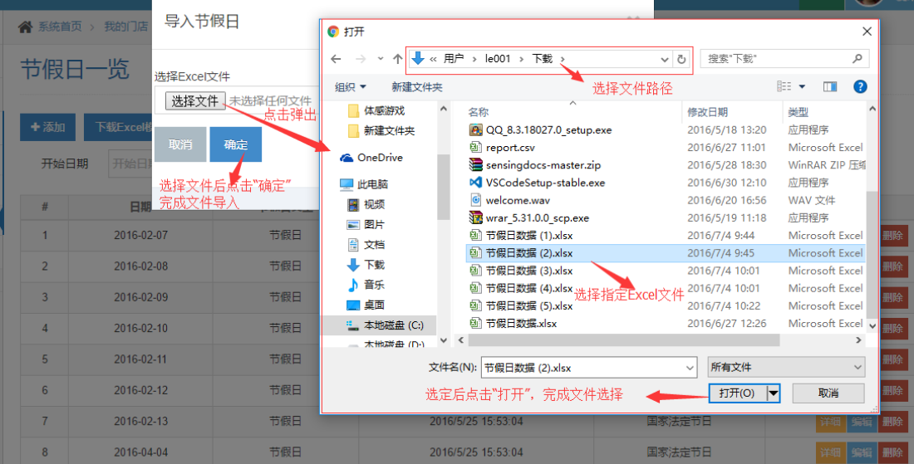

6.个人设定 
^^^^^^^^^^^
  a. 修改个人信息：在“基本信息”页面对应的信息框中输入要修改的信息点击“√”后完成操作。
  b. 修改密码：在“密码设置”页面输入原始密码，然后键入新的密码并二次确认，点击保存按钮，当前账户密码修改成功。
  
个人信息

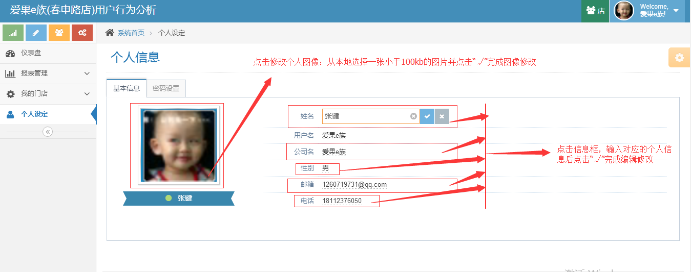

修改密码

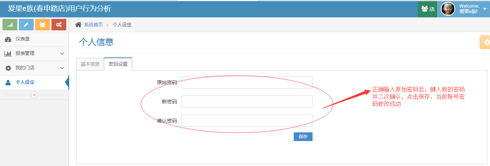

