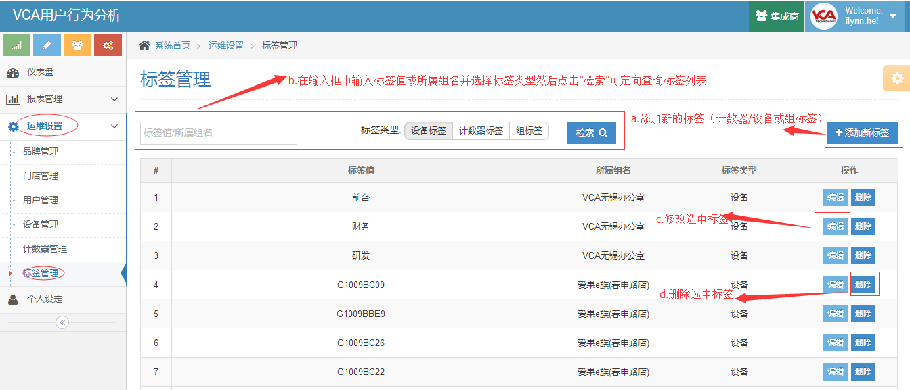
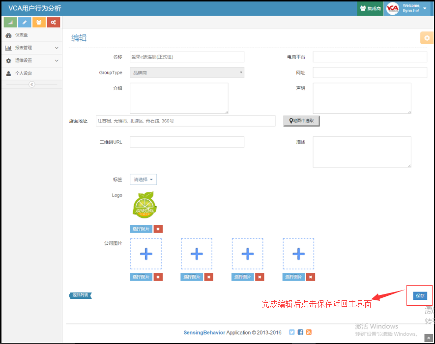

云后台集成商使用教程
==========================

by `Kevin`

.. toctree::
   :titlesonly:

.. note:: 本页面图片根据原图按比例缩放，可使用ctrl+鼠标滚轮放大至200%进行全屏查看。

.. contents:: Sections:
  :local:
  :depth: 2

功能权限说明
-----------
   作为云后台的数据管理者，集成商需要保障品牌商和门店的客流数据实时更新并进行相应的数据更改。

功能权限概叙 
-------------
   1. 门店管理：查询、新建门店，修改门店信息。
   #. 标签管理：标签是设备、计数器在已有信息的基础上建立的虚拟成像，是设备、计数器与报表建立关联的桥梁。集成商需要为每台设备和计数器创建标签，这是整个流程框架的基础。
   #. 设备管理：这里的“设备”指的是摄像头，中控机将获取到的摄像头信息（设备名、类别、内网地址等）同步上传至云后台，集成商需要为对应的设备添加设备标签等信息，必要时可删除设备。
   #. 计数器管理：“计数器”？摄像头划定的区域指定算法的客流数量统计。中控机将获取到的计数器信息（对应设备、计数器名等）同步到云后台，集成商需要添加计数器标签等信息，亦可删除计数器。
   #. 报表管理：集成商配置完所有必要信息后，需要创建一些按照一定规则集成信息的报表，且完成一些报表的修改、删除等操作。
   #. 用户管理：用户是门店数据的查看者和采集者，集成商需要为每个门店创建若干用户，并且对用户进行限制管理（可锁定账号、重置用户密码）。
   #. 品牌管理：查询并修改品牌商信息。
   #. 个人设定：修改集成商自己的个人信息及密码。

详细功能及操作介绍 
--------------------

1.门店管理 
^^^^^^^^^^^^
     a. 创建门店：对门店进行管理的前提是有门店可管，所以，对于门店管理的首要任务就是创建门店——点击“新建组”页面跳转到“创建门店”页面，
        输入门店名称，选取“GroupType”和对应的上层分组，从地图中选取店面地址（拖动红色坐标点移动）或直接输入地址，完成各项需要输入的信息后点击“保存”，
        页面跳转回门店管理页面，此时您所创建的门店将在功能区列表中显示，创建门店成功。
     #. 门店查询：在“检索”一栏输入框中输入想要查询的门店（可模糊查询），然后点击“检索”，即可查询出对应的门店列表。
     #. 查看门店信息：点击列表栏“详细”按钮即可进入到门店信息查看界面,查看完信息后点击“返回列表”即可返回门店管理主界面。
     #. 修改门店信息：点击列表栏最后一项“编辑”，即可进入门店编辑界面。编辑完成后点击“保存”，页面跳转回门店管理主界面，修改操作完成。

门店管理主界面
 

创建门店界面

2.标签管理
^^^^^^^^^^^^
``使用云后台创建报表首要任务是为设备和计数器建立标签，标签是设备、计数器与报表建立关联的桥梁。``
   a. 添加新标签：点击“添加新标签”按钮，页面跳出添加标签弹出框，选择对应组名和标签类型并输入标签内容，点击“确定”按钮完成添加。
   #. 标签查询：在检索一栏输入框中输入标签值或所属组名并选择标签类型然后点击“检索”可定向查询标签列表。
   #. 修改标签：点击操作栏“编辑”按钮，页面跳出编辑标签弹出框，修改对应内容后点击“确定”完成修改操作。
   #. 删除标签：点击操作栏“删除”按钮，弹出框提示是否确定删除，点击确定即可删除当前标签。

标签管理主界面

添加新标签

3.设备管理
^^^^^^^^^^^^
   a. 编辑设备：点击操作栏“编辑”按钮，页面跳出“编辑设备”弹出框，选择对应设备标签并输入“覆盖面积”和“安装地址”后点击“确定”按钮完成编辑操作。
   b. 查看设备详情：点击操作栏“详情”按钮，页面跳转至设备详情界面，可查看到设备的详细信息、设备内计数器线图报表和热力图。
   c. 设备查询：在检索一栏输入设备名或所属组名后点击“检索”可定向查询设备列表（支持模糊查询）。
   d. 删除设备：点击操作栏“删除”按钮，弹出框提示是否确定删除，点击确定即可删除当前设备。

设备管理主界面

编辑设备

4.计数器管理
^^^^^^^^^^^^
   a. 编辑计数器：点击操作栏“编辑”按钮，页面跳出“编辑计数器”弹出框，选择对应计数器标签并输入“描述”和“目标物”后点击“确定”按钮完成编辑操作。
   b. 计数器查询：在检索一栏输入设计数器名、所属分组或所属设备后点击“检索”可定向查询计数器列表（支持模糊查询）。
   c. 删除计数器：点击操作栏“删除”按钮，弹出框提示是否确定删除，点击确定即可删除当前计数器。

计数器管理

编辑计数器

5.报表管理
^^^^^^^^^^^^
   a. 添加报表：点击“添加报表”按钮，跳转至“创建报表”页面，输入报表名、选择对应组名和报表模板，随后页面跳出一条数据源信息编辑框，输入数据源名称，选择对应的设备规则和计数器规则，点击保存按钮，完成一表一条数据源的编辑。如果需要在一张表中展现多数据源，则点击“添加数据源”继续完成数据源的编辑，完成后点击保存即可生成报表。
   b. 修改报表：点击操作栏中的“编辑”按钮即可进入到修改报表界面，修改对应内容后点击保存，页面跳转回报表管理主界面，操作完成。
   c. 查看报表数据：点击操作栏中“数据”按钮进入到当前报表数据展示界面。
   d. 查询报表：在检索一栏输入报表名称或所属分组并点击“检索”可定向查询报表列表（支持模糊查询）。
   e. 删除报表：点击操作栏“删除”按钮，弹出框提示是否确定删除，点击确定即可删除当前报表。

报表管理

报表查看

创建报表

6.用户管理
^^^^^^^^^^^^
   a. 添加用户：点击“添加用户”按钮，页面跳转至添加用户界面，选择一本地图片作为用户头像，输入用户的用户名、电话、邮箱，选择对应“组名”，选择权限角色，点击保存按钮完成添加编辑（用户默认密码为1qaz@WSX）。
   b. 重置用户密码：点击“密码重置”，跳出密码重置弹出框，在密码重置一栏输入修改后的密码，点击保存，完成对用户的密码修改。
   c. 锁定用户账户：为防止信息泄露，可以对部分暂时不用的用户账号进行锁定，锁定后目标账号将无法登陆。
   d. 查询用户：在检索一栏输入用户名、角色或所属组名点击检索可定向查询用户列表（支持模糊查询）。

用户管理

添加用户

用户密码重置

7.品牌管理
^^^^^^^^^^^^ 
   a. 查看品牌信息：点击操作一栏“详情”按钮可查看品牌对应点详细信息。
   b. 修改品牌信息：点击操作一栏“编辑”按钮可对品牌信息进行修改，修改完成后点击保存即可。
   c. 品牌查询：在检索栏输入品牌名称并点击“检索”可定向查询品牌列表。

品牌管理主界面

品牌编辑界面

8.个人设定 
^^^^^^^^^^^^
   a. 修改个人信息：在“基本信息”页面对应的信息框中输入要修改的信息点击“√”后完成操作。
   b. 修改密码：在“密码设置”页面输入原始密码，然后键入新的密码并二次确认，点击保存按钮，当前账户密码修改成功。

个人信息

个人设定

部署常见故障及解决方案
----------------------
1. 当前电脑系统32位：下载并替32位 mfc100 dll。
2. behavior上摄像头型号找不到：摄像头型号都找不到的时候就要考虑看看摄像头的端口号了，摄像头端口号一定要设定为80  如果是80依然不行，直接在设备里输入ip号添加并刷新。
3. 云平台上设备找不到的情况：需要等待15min左右,等待时间已过任然没有------查看log当显示设备类型不支持时，联系troncell技术人员登陆超管账号查看，复制摄像头在线型号粘贴到设备类别检索框查询下是否存在，如果没有就需要添加设备类型（复制的在线型号添加进去即可）。
4. 一切正常但是浏览器打开localhost：8090并未成功加载，更换谷歌、火狐或edge浏览器打开localhost：8090。（ie浏览器的兼容性比较差）