购物屏云平台品牌商使用教程
==========================

by `Kevin`

.. toctree::
   :titlesonly:

.. note:: 本页面图片根据原图按比例缩放，可使用ctrl+鼠标滚轮放大至200%进行全屏查看。

.. contents:: Sections:
  :local:
  :depth: 2

登录
--------------
登录地址：
http://store.troncell.com

登录界面 

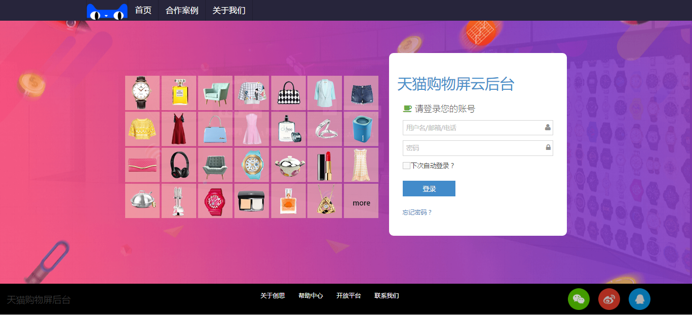

step1.正确输入账号、密码;step.2点击“登录”按钮。

平台主界面

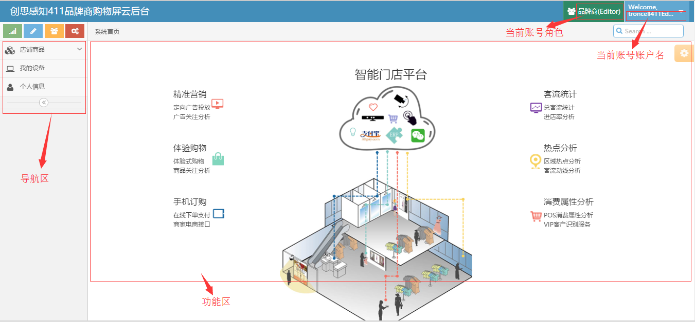

功能权限概叙 
-------------
   1. 品类管理：对商品的品类进行增删改查操作。
   #. 同步淘宝商品：一键同步淘宝平台的商品到当前云台并上线展示在大屏端。
   #. 手动添加商品：手动添加未获取到的淘宝商品到大屏端展示。
   #. 修改大屏商品信息：可对大屏上的商品信息（名称、图片、描述等）进行修改。
   #. 商品查看：根据商品状态、商品来源、淘宝状态筛选项定向查询对应商品。
   #. 我的设备：查看当前账号对应设备相关信息。
   #. 个人信息：修改编辑个人信息、密码。
 

详细功能及操作介绍 
--------------------

1.品类管理
^^^^^^^^^^^^
     点击菜单项 店铺商品/品类管理，右侧的功能区展示界面即为品类管理界面。
       a. 添加商品类别：点击当前界面右上角“添加商品类别”按钮，页面跳转至新增商品类别界面，输入类别名称（图片链接和描述选填），点击保存按钮，完成类别添加。
       b. 编辑商品类别：点击操作栏“编辑”按钮，页面跳转至编辑页，修改名称后点击保存，完成编辑操作。
       c. 删除商品类别：点击操作栏“删除”按钮，并确定，即可删除当前商品类别。
       d. 查询商品类别：在检索输入框内输入想要查询的类别名称，并单击检索，可定向查询对应的商品类别。      

品类管理主界面

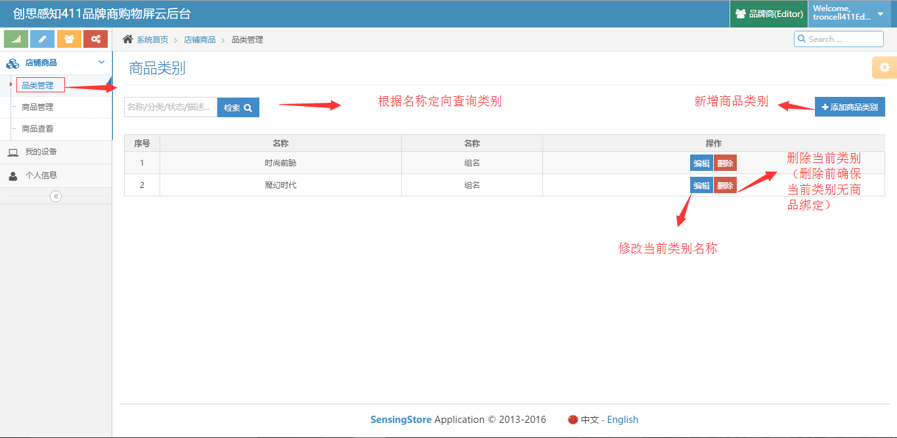

添加商品类别界面

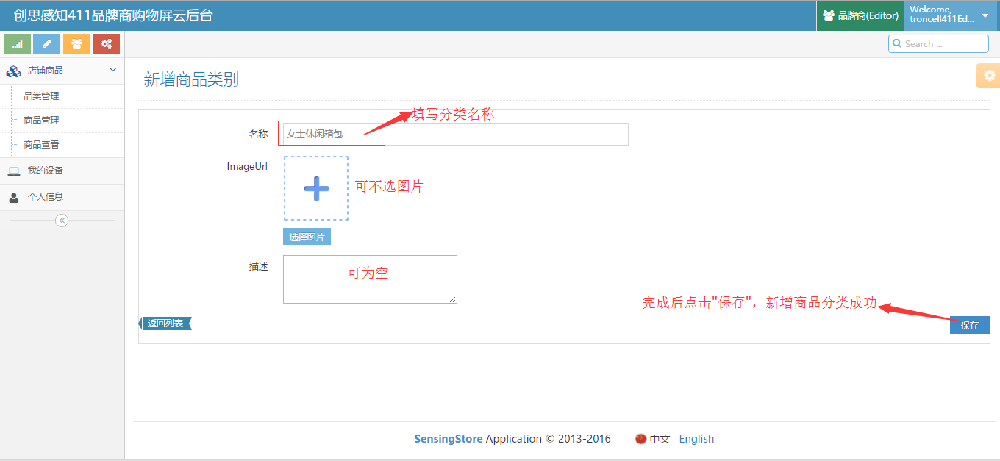

2.同步淘宝商品
^^^^^^^^^^^^
   点击菜单项 店铺商品/商品管理，右侧的功能区展示界面即为商品管理界面。点击页面右侧的“同步淘宝商品”按钮并“确认”，
   淘宝平台的商品即呈现在“初始商品”一栏（如果为空，说明当前数据已是最新），选择对应商品，点击上线按钮“↑”（或选择“表格视图”模式勾选商品，点击“一键申请上线”）。

同步淘宝商品

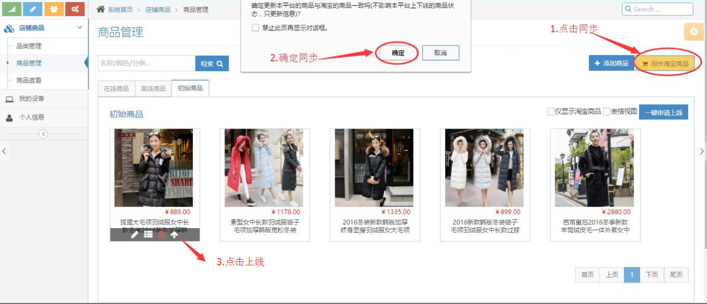

表格模式同步

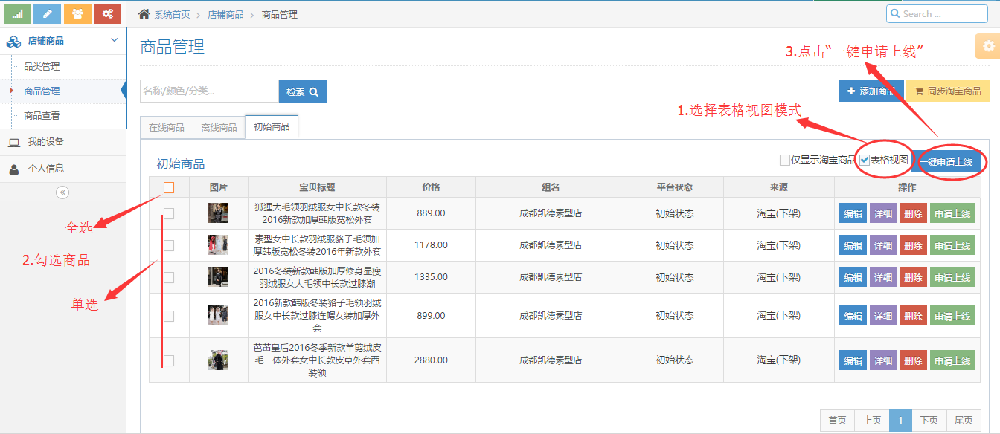

3.手动添加商品
^^^^^^^^^^^^^^^^
   点击菜单项 店铺商品/商品管理，右侧的功能区展示界面即为商品管理界面。点击页面右侧的“添加商品”按钮，
   页面跳转至“添加商品”界面，完成商品相关信息后点击保存按钮完成添加。

.. attention:: 二维码链接需真实有效，用户使用“手机淘宝”扫码可进入到对应淘宝商品链接。

添加商品界面入口

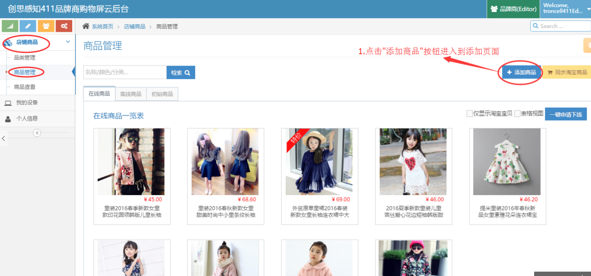

添加商品界面

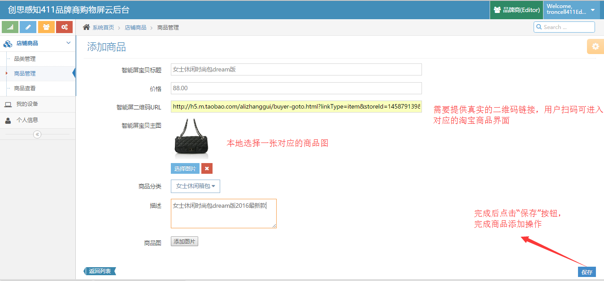

4.修改大屏商品信息
^^^^^^^^^^^^^^^^^^^
   点击菜单项 店铺商品/商品管理，右侧的功能区展示界面即为商品管理界面。
     1. 在“在线商品”一栏检索输入框中输入商品名称或商品itemid，查询定位到对应的商品。
     2. 点击商品下方的下线按钮“↓”将产品下线（修改商品信息需先将商品下线）。
     3. 在“离线商品”一栏找到需要修改的商品，点击商品下方的“编辑”按钮，页面跳转至编辑页。
     4. 编辑页选择“自定义信息”项，在对应输入框输入修改的信息后点击“保存”，页面返回“离线商品”页面。
     5. 点击商品下方的上线按钮“↑”，将商品上线，信息修改完成。

修改信息1

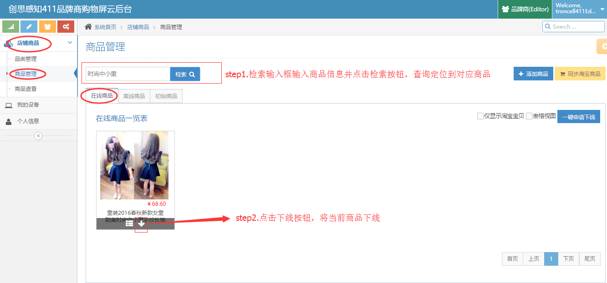

修改信息2

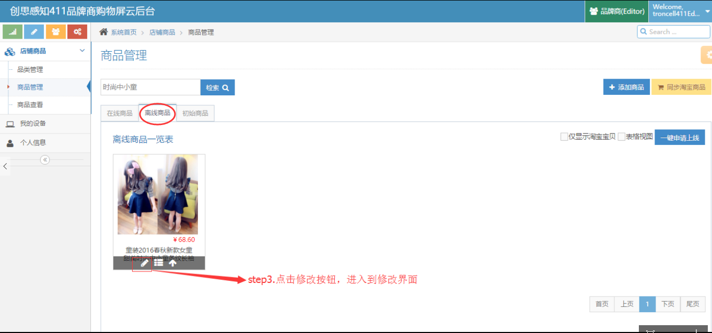

修改信息3

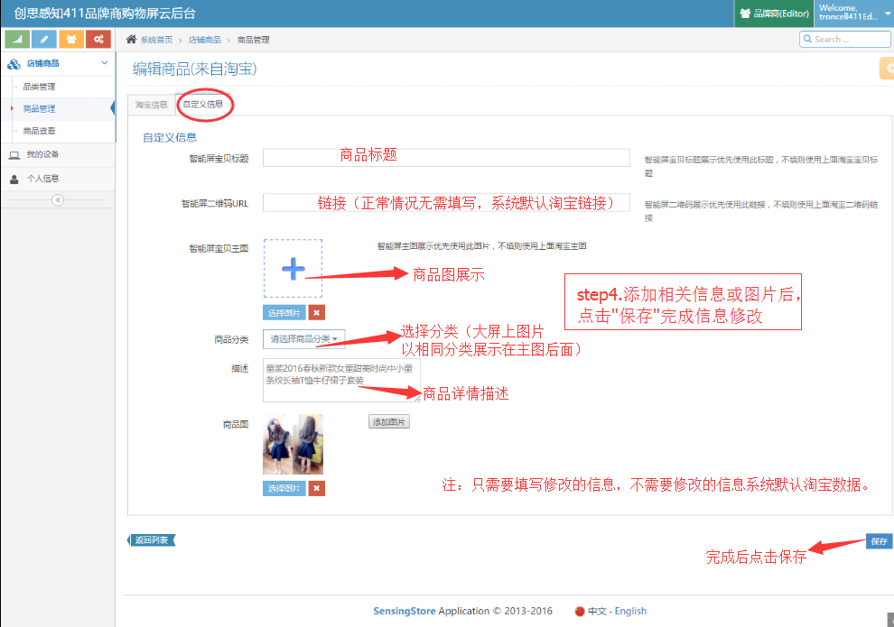

修改信息4

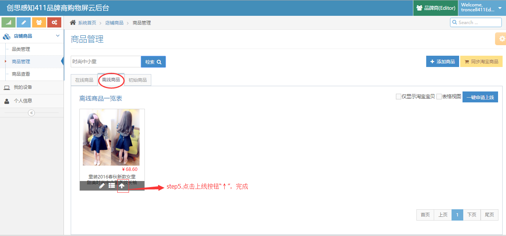

5.我的设备
^^^^^^^^^^^^
   查看当前品牌商对应大屏设备信息。

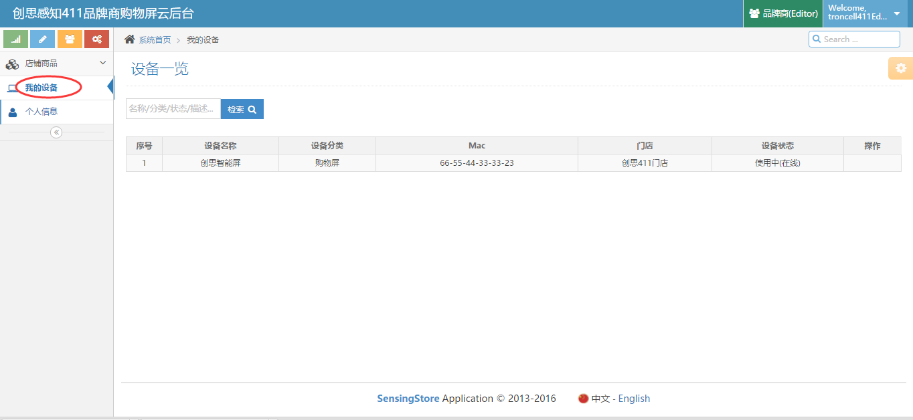

6.个人信息
^^^^^^^^^^^^
  修改当前账号个人信息和密码。

修改个人信息

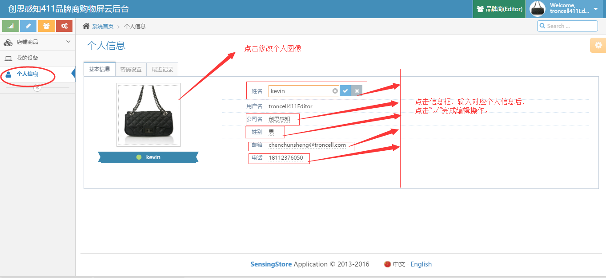

修改密码

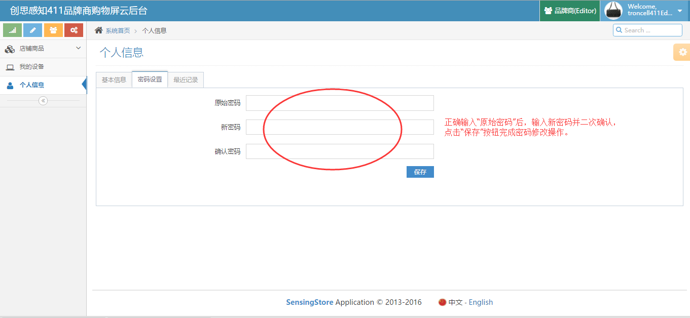

