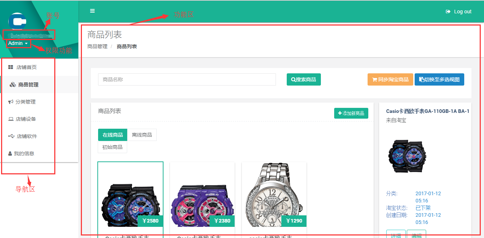

购物屏云平台品牌商使用教程
==========================

by `Kevin`

.. toctree::
   :titlesonly:

.. note:: 本页面图片根据原图按比例缩放，可使用ctrl+鼠标滚轮放大至200%进行全屏查看。

.. contents:: Sections:
  :local:
  :depth: 2

登录
--------------
登录地址：
http://store.troncell.com

登录界面 

step1.正确输入账号、密码;step.2点击“登录”按钮。

平台主界面

功能权限概叙 
-------------
   1. 品类管理：大屏端，所示商品可按照“品类”进行分类查看，点击对应品类按钮，大屏上将只展示对应的商品。后台此项操作可对商品的品类进行增删改查。
   #. 同步淘宝商品：一键同步淘宝平台的商品到当前云台并上线展示在大屏端。
   #. 手动添加商品：手动添加未获取到的淘宝商品到大屏端展示。
   #. 下线购物屏商品：将购物屏上展示的部分商品下线。
   #. 修改大屏商品信息：可对大屏上的商品信息（名称、图片、分类、描述等）进行修改。

 

详细功能及操作介绍 
--------------------

1.品类管理
^^^^^^^^^^^^
     点击菜单项 分类管理，右侧的功能区展示界面即为品类管理界面。
       a. 添加商品类别：点击当前界面右上角“添加新类别”按钮，页面跳转至新增商品类别界面，输入类别名称、选择“图片”(分类列表内显示的图片，如下图所示)和“icon”（分类的按钮图片，如下图所示），父分类可不选择，勾选“是否在大屏显示”，点击“确认添加”按钮，完成类别添加。
       b. 编辑商品类别：点击操作栏“编辑”按钮，页面跳转至编辑页，修改名称后点击保存，完成编辑操作。
        

品类管理主界面

添加商品类别界面

2.同步淘宝商品
^^^^^^^^^^^^^^^^^^^
   点击菜单项 商品管理，右侧的功能区展示界面即为商品管理界面。
       a. 选择初始商品。
       #. 点击页面右侧的“同步淘宝商品”按钮，淘宝平台新上架的商品即会呈现在“初始商品”一栏（如果为空，说明当前数据已是最新）。
       #. 点击“切换至多选视图”。
       #. 点击对应想要上架的商品（可多选）。
       #. 选择后点击页面右侧的“批量上线”按钮，商品上线完成（上线后的商品将显示在“在线商品”一栏）。

同步淘宝商品

3.手动添加商品
^^^^^^^^^^^^^^^^
   点击菜单项 商品管理，右侧的功能区展示界面即为商品管理界面。点击页面右侧的“添加新商品”按钮，
   页面跳转至“添加商品”界面，完成商品相关信息后点击保存按钮完成添加。

.. attention:: 二维码链接需真实有效，用户使用“手机淘宝”扫码可进入到对应淘宝商品链接。

添加商品界面入口

添加商品界面

4.下线购物屏商品
^^^^^^^^^^^^^^^^^
   点击菜单项 商品管理，右侧的功能区展示界面即为商品管理界面。
     a. 在“在线商品”一栏检索输入框中输入对应商品名称，查询定位到对应的商品。
     b. 点击“切换至多选视图”。
     c. 点击选择商品。
     d. 点击“批量下线”按钮。
     e. 重启软件，商品将不再显示。

商品下线

5.修改大屏商品信息
^^^^^^^^^^^^^^^^^^^
   点击菜单项 商品管理，右侧的功能区展示界面即为商品管理界面。
     a. 在“在线商品”一栏检索输入框中输入商品名称，查询定位到对应的商品。
     b. 点击商品图。
     c. 点击展示图下“编辑”按钮，页面跳转至编辑界面。
     d. 编辑页选择“平台自定义信息”项，在对应输入框输入修改的信息后点击“保存”（不变的信息无需填写）。
     e. 重启软件修改即完成。

修改信息1

修改信息2

